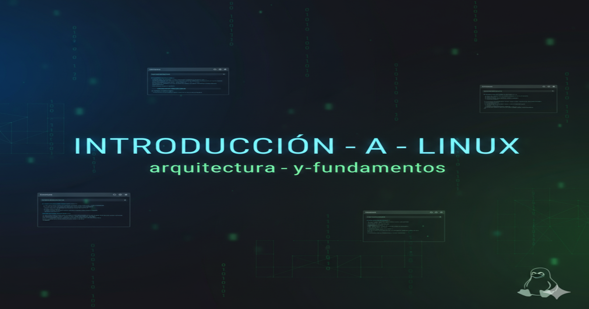
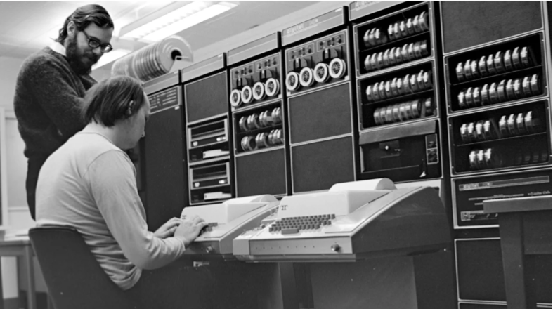

= Introducción a Linux y Arquitectura del Sistema
:author: Alex Callejas
:doctype: article
:revdate: Oct 1, 2025
:keywords: linux, historia, gnu, kernel, shell, distros, boot, runlevels

== Historia y filosofía del código abierto (Open Source)

=== Un poco de historia

En 1970, **Ken Thompson** escribe el primer sistema operativo **Unix** en una **PDP-7**, basado en **Multics** (una derivación del proyecto MAC de los Laboratorios Bell que creó el sistema operativo de tiempo compartido _Multiplexed Information and Computing Service_). Su compañero de proyecto, **Brian Kernighan**, sugiere el nombre **UNICS** (_Uniplexed Information & Computing Service_). Consiste en un **núcleo (kernel)**, un **intérprete de comandos (shell)**, un editor y un ensamblador (el ensamblador guarda los archivos como «a.out»). En 1972, otro de sus socios en el proyecto, **Dennis Ritchie**, crea el **lenguaje C** que será una parte fundamental del sistema operativo.

.Figura 1: Dennis Ritchie y Ken Thompson en la PDP-11 en 1972. Bell Labs.

A partir de entonces continuaron los esfuerzos por crear sistemas operativos compatibles con el hardware emergente, chips más rápidos y capacidades cada vez mayores. Al mismo tiempo, surgían dos tendencias para el desarrollo de nuevos sistemas: por un lado, las grandes corporaciones hacían privado su código, llegando incluso a litigios como el de **AT&T** (_USL - UNIX System Laboratories, Inc._) contra **BSD** (_Berkeley Software Design, Inc._), ya que **BSD** contenía código **Unix** propiedad de **AT&T**; por otro lado, _la comunidad de estudiantes y entusiastas_ aportaba código sin ánimo de lucro para el desarrollo y mejora del sistema operativo.

=== El Nacimiento de GNU y el Software Libre

La filosofía de **código abierto** (Open Source) tiene sus raíces en el movimiento del **Software Libre**, impulsado por **Richard Stallman** en 1983, con la fundación del **Proyecto GNU**. Stallman se opuso a la tendencia de cerrar el código fuente, fundando la **Free Software Foundation (FSF)** y desarrollando la licencia **GPL** (General Public License).

El Software Libre se define por las cuatro libertades esenciales:

* **Libertad 0:** Ejecutar el programa para cualquier propósito.
* **Libertad 1:** Estudiar cómo funciona el programa y modificarlo.
* **Libertad 2:** Redistribuir copias a quien se desee.
* **Libertad 3:** Distribuir copias de las versiones modificadas.

=== GNU/Linux: La unión hace la fuerza

En 1991, **Linus Torvalds** desarrolló y publicó el núcleo (kernel) de **Linux**, inspirándose en el sistema **MINIX**. Linux proporcionó el componente fundamental que faltaba para completar el sistema operativo **GNU** de Richard Stallman, creando lo que hoy conocemos como **GNU/Linux**.

Las primeras distribuciones de Linux surgieron rápidamente:

* **Slackware** se lanzó en 1993 y sigue siendo la distribución más antigua que se mantiene, destacando por su simplicidad.
* **Debian**, fundado por **Ian Murdock**, se distinguió por su compromiso con el software libre y su robusto sistema de gestión de paquetes (`apt`). Debian se convirtió en la base de distribuciones posteriores, incluida **Ubuntu**.
* **Red Hat Linux** se introdujo en 1994, enfocándose en usuarios empresariales y ofreciendo soporte comercial. Más tarde evolucionó a **Red Hat Enterprise Linux (RHEL)** y el **Proyecto Fedora**.
* En la década de 2000, surgieron distribuciones populares como **Ubuntu** (2004), conocido por su facilidad de uso, y **Arch Linux** (2002), que abogó por la simplicidad y un modelo de lanzamiento continuo (_rolling release_).

***

== Conceptos clave: Kernel, Shell y Distribuciones

=== 1. El Kernel (Núcleo)

El **Kernel** es el corazón de cualquier sistema operativo. Actúa como el **puente** o mediador principal entre el **hardware** de la computadora y el software o los procesos de usuario.

Sus funciones críticas incluyen:

* **Gestión de Procesos:** Controla el ciclo de vida de cada aplicación, asignando los ciclos de la CPU y estableciendo prioridades.
* **Gestión de Memoria:** Administra la memoria RAM y la memoria virtual, garantizando que cada proceso tenga el espacio necesario sin interferir con otros.
* **Controladores de Dispositivos (Drivers):** Permite que el sistema operativo se comunique con el hardware conectado (teclado, disco, red, etc.).

=== 2. El Shell (Intérprete de Comandos)

El **Shell** es la capa más externa del sistema operativo. Es la **interfaz** que permite al usuario interactuar con el Kernel, aceptando comandos legibles por humanos y traduciéndolos al lenguaje que el núcleo entiende para su ejecución.

* En Linux, el shell más popular y predeterminado es **Bash** (*Bourne Again Shell*).
* Se accede al shell a través de un **emulador de terminal**.
* Además de ejecutar comandos interactivos, el shell incluye un lenguaje de programación para crear **Scripts de Shell**, que permiten automatizar tareas repetitivas y complejas.

=== 3. Las Distribuciones (Distros)

Una **distribución de Linux** es el kernel de Linux empaquetado junto con el sistema GNU, software adicional (como el entorno de escritorio, aplicaciones, y un gestor de paquetes) y una configuración específica. La variedad de distribuciones (como Debian, Fedora, Ubuntu o Arch) permite que Linux se adapte a cualquier necesidad, desde servidores empresariales (RHEL, CentOS) hasta equipos de escritorio o sistemas embebidos.

***

== El proceso de arranque (BIOS/UEFI, gestores de arranque como GRUB/GRUB2)

El proceso de arranque de un sistema Linux es una secuencia meticulosa de pasos que va desde el encendido de la máquina hasta la carga completa del sistema operativo.

[cols="1,1,2", options="header"]
|===
| Etapa | Componente Principal | Función
| **1.** | **BIOS/UEFI** | Es el firmware que se activa al encender la computadora. Realiza una verificación inicial del hardware (POST) y localiza el gestor de arranque.
| **2.** | **Gestor de Arranque** | El firmware transfiere el control al *bootloader* (**GRUB** o **GRUB2** es el más común en Linux). GRUB carga el menú que permite seleccionar el sistema operativo o un **kernel** específico para iniciar.
| **3.** | **Inicialización del Kernel** | El Kernel seleccionado se carga en la memoria. Comienza a inicializar sus subsistemas, a configurar los controladores de hardware esenciales y monta un sistema de archivos en memoria (**initramfs** o **initrd**).
| **4.** | **Systemd/Init** | El kernel inicia el primer proceso de usuario (PID 1), que en los sistemas modernos es **systemd**. Systemd es el encargado de iniciar el resto de los servicios del sistema de forma eficiente (a menudo en paralelo), llevando la máquina al estado operativo final (**target**).
|===

***

== Niveles de ejecución (runlevels y targets de systemd)

Los **Niveles de Ejecución** (o _Runlevels_) definen el estado operativo de un sistema Linux. El sistema tradicional **SysV init** usaba números (0 al 6) para estos estados, mientras que el sistema moderno **systemd** utiliza nombres, a los que llama **Targets** (objetivos).

Systemd mantiene la compatibilidad con los runlevels de SysV, mapeando cada número a un target específico:

[cols="1,2,2", options="header"]
|===
| Runlevel (SysV Init) | Target equivalente (systemd) | Descripción del estado
| **0** | poweroff.target[poweroff.target] | Apaga el sistema.
| **1** | rescue.target[rescue.target] | Modo de rescate o usuario único. Mínimo de servicios activos, ideal para tareas de mantenimiento.
| **2, 3, 4** | multi-user.target[multi-user.target] | Modo multiusuario completo con red, pero **sin interfaz gráfica** (solo línea de comandos).
| **5** | graphical.target[graphical.target] | Modo multiusuario completo con **entorno gráfico** (GUI) y red. Es el modo de escritorio predeterminado.
| **6** | reboot.target[reboot.target] | Reinicia el sistema.
|===

// Enlace de la publicación original (para versiones fuera de GitHub)
// link:https://www.rootzilopochtli.com/1-introduccion-a-linux-y-arquitectura-del-sistema [Publicación Original del Blog]

***

== Invitación a la Comunidad 🚀

Este _post_ forma parte de una serie dedicada a la arquitectura y administración de sistemas Linux. ¡Queremos construir el mejor recurso posible **con tu ayuda**!

Te invitamos a:

* **Clonar el Repositorio:** El código fuente de todos nuestros artículos está disponible en **GitHub**.
* **Contribuir:** Si encuentras algún error, tienes sugerencias para mejorar la claridad de los conceptos o deseas proponer correcciones técnicas, no dudes en enviar un _Pull Request_ (Solicitud de extracción).
* **Comentar:** ¿Tienes una pregunta o un punto de vista diferente sobre algún concepto? Abre un _Issue_ (Incidencia) en el repositorio para iniciar la discusión.

Tu colaboración es vital para mantener este contenido preciso y actualizado.

**¡Encuentra el repositorio y participa aquí:** https://github.com/rootzilopochtli/introduccion-a-linux[github.com/rootzilopochtli/introduccion-a-linux]
