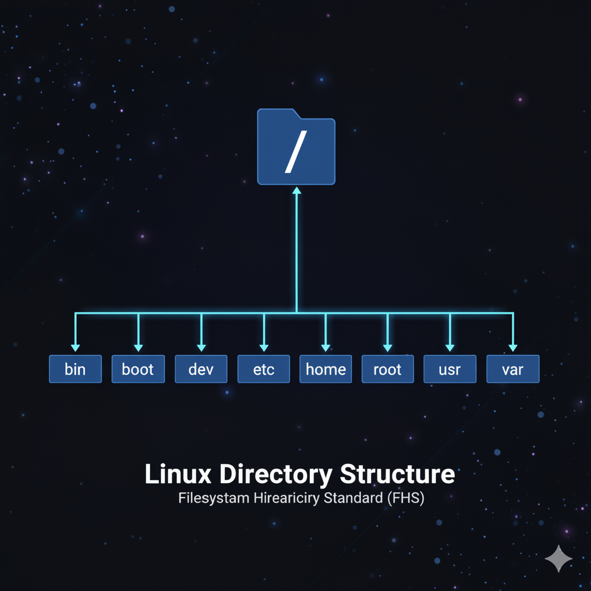

= Estructura de Directorios de Linux: Conoce el Corazón de tu Sistema 🐧
:author: Alex Callejas
:doctype: article
:revdate: Oct 2, 2025
:keywords: linux, fhs, directorios, filesystem, comandos

La estructura de directorios de Linux no es arbitraria; se rige por el estándar *Filesystem Hierarchy Standard (FHS)*, el cual establece un conjunto de reglas sobre cómo debe ser la estructura de directorios de un sistema operativo Linux.

Este estándar define los propósitos, ubicaciones y contenidos esperados para los directorios principales, asegurando que el sistema operativo y las aplicaciones puedan funcionar de manera predecible en cualquier distribución de Linux.

.Figura 2.1 - La estructura de directorios en Linux

---

La idea central es que *todo en Linux es un archivo* (incluso un directorio que contiene archivos), y la estructura comienza en un único punto: el directorio raíz (`/`).

Para visualizar esta idea, imagina una fila de archivos, uno seguido de otro. Un *directorio* es un *archivo separador* que indica que todos los demás archivos después de él, están contenidos dentro de él.

.Figura 2.2 - Todo en Linux es un archivo

---

== Directorios Clave y su Propósito 📂

El FHS establece una serie de directorios con funciones muy específicas. Aquí tienes una descripción de los más importantes:

[cols="1,4a", options="header"]
|===
|Directorio |Descripción
|`/` |*Raíz (Root)*. Es el nivel superior de toda la jerarquía de directorios. Todos los demás directorios y archivos se ramifican a partir de este punto.
|`/home` |Contiene los *directorios personales* de los usuarios. Aquí es donde los usuarios almacenan sus archivos, configuraciones y datos. Por ejemplo, `/home/usuario`.
|`/etc` |*Archivos de configuración*. Contiene los archivos de configuración estáticos, específicos de la máquina, que controlan el sistema (ej: `/etc/passwd`, `/etc/fstab`).
|`/var` |*Archivos de datos variables*. Contiene datos que se modifican con frecuencia, como *logs* del sistema (`/var/log`), *spool* de correo o impresión, y archivos temporales de aplicaciones web.
|`/boot` |*Archivos de arranque*. Contiene los archivos necesarios para el proceso de arranque de Linux, incluyendo el *kernel* y los archivos del gestor de arranque *GRUB*.
|`/usr` |*Jerarquía de sistema compartida (Unix System Resources)*. Contiene la mayoría de los programas ejecutables, bibliotecas, documentación y archivos fuente (ej: `/usr/bin`, `/usr/lib`). Es grande y solo de lectura en el uso normal.
|`/usr/bin`|*Binarios de usuario*. Contiene todos los comandos ejecutables, y que son utilizados por todos los usuarios (ej: `ls`, `cat`, `mv`).
|`/usr/lib`|*Bibliotecas*. Contiene las bibliotecas de ligado dinámico (típicamente denominadas `*.so`) con que pueden vincularse los diversos programas que utilizan los usuarios.
|`/usr/sbin`|*Binarios de administración*. Contiene todos los comandos ejecutables que son principalmente utilizados por el administrador (ej: `fdisk`, `adduser`, y diversos demonios).
|`/tmp` |*Archivos temporales*. Contiene archivos temporales creados por el sistema y los usuarios. Su contenido se borra a menudo al reiniciar el sistema.
|===

---

== Navegación Básica: Tus Primeros Comandos 🧭

Dominar la línea de comandos comienza con saber dónde estás y cómo moverte. Aquí están las tres herramientas de navegación esenciales que todo administrador debe conocer:

=== `pwd` (Print Working Directory)

Muestra la *ruta absoluta* del directorio actual donde te encuentras. Es tu comando para saber *exactamente* dónde estás en la jerarquía del sistema.

[source, bash]
----
$ pwd
/home/usuario
----

=== `cd` (Change Directory)

Permite *cambiar el directorio actual*. Puedes usar rutas absolutas (que comienzan en `/`) o rutas relativas (a partir de tu posición actual).

[cols="1,2a", options="header"]
|===
|Comando |Acción
|`cd /etc` |Mueve al directorio de configuración (ruta absoluta).
|`cd ..` |Sube un nivel en la jerarquía (al directorio padre).
|`cd ~` |Mueve a tu directorio personal (`/home/usuario`).
|`cd` |Lo mismo que `cd ~`.
|`cd -` |Regresa al directorio anterior (siempre que haya uno en el historial).
|===

=== `ls` (LiSt)

Muestra una *lista del contenido* (archivos y subdirectorios) del directorio actual o de uno especificado.

[cols="1,2a", options="header"]
|===
|Comando |Acción
|`ls` |Lista el contenido del directorio actual.
|`ls -l` |Muestra la lista con un *formato largo* (permisos, propietario, tamaño, fecha).
|`ls -a` |Muestra *todos los archivos*, incluyendo los ocultos (que empiezan por un punto `.`).
|`ls -lah` |Una combinación popular: Largo, Todos, y tamaño legible por humanos.
|`ls -ltr` |Muestra todos los archivos visibles (no ocultos) en orden descendente por fecha de creación.
|===

¡Con estos comandos, ya puedes empezar a explorar el corazón de tu sistema Linux! La práctica constante es clave para dominar la estructura de directorios y prepararte para tus certificaciones.

== Invitación a la Comunidad 🚀

Este _post_ forma parte de una serie dedicada a la arquitectura y administración de sistemas Linux. ¡Queremos construir el mejor recurso posible **con tu ayuda**!

Te invitamos a:

* **Clonar el Repositorio:** El código fuente de todos nuestros artículos está disponible en **GitHub**.
* **Contribuir:** Si encuentras algún error, tienes sugerencias para mejorar la claridad de los conceptos o deseas proponer correcciones técnicas, no dudes en enviar un _Pull Request_ (Solicitud de extracción).
* **Comentar:** ¿Tienes una pregunta o un punto de vista diferente sobre algún concepto? Abre un _Issue_ (Incidencia) en el repositorio para iniciar la discusión.

Tu colaboración es vital para mantener este contenido preciso y actualizado.

**¡Encuentra el repositorio y participa aquí:** https://github.com/rootzilopochtli/introduccion-a-linux[github.com/rootzilopochtli/introduccion-a-linux]
