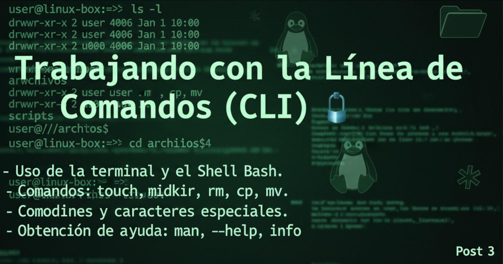

= Trabajando con la Línea de Comandos (CLI) 💻
:author: Alex Callejas
:doctype: article
:revdate: Oct 3, 2025
:keywords: linux, bash, cli, comandos

[abstract]
¡Bienvenido/a a la tercera entrega de nuestra serie sobre fundamentos de *Linux* para certificaciones! Si las entradas anteriores te prepararon para el viaje, esta te equipará con el volante y el mapa: vamos a dominar la *Línea de Comandos (CLI)*, la herramienta más potente en el arsenal de cualquier administrador de sistemas.

---

== La Terminal y el Poder del Shell Bash

La *Terminal* es la ventana a tu sistema Linux. Dentro de ella, la magia sucede gracias al *Shell*, que actúa como un intérprete entre tú y el núcleo (kernel) del sistema operativo. Aunque existen varios shells, *Bash (Bourne-Again Shell)* es el estándar en la mayoría de las distribuciones y en los exámenes de certificación como LPIC-1, LFCS y RHCSA.

Bash te permite ejecutar comandos, automatizar tareas y configurar el sistema de formas que son imposibles o imprácticas con una interfaz gráfica. Es donde se concentra la verdadera eficiencia y control.

---

== Comandos Esenciales para Manejo de Archivos y Directorios

El día a día en la CLI implica navegar y manipular el sistema de archivos. Aquí tienes los comandos fundamentales que debes dominar:

[cols="1,3,5"]
|===
|Comando |Función |Ejemplo de Uso

|`ls`
|Lista el contenido de un directorio.
|`ls -lha` (muestra detalles, tamaños legibles y archivos ocultos)

|`touch`
|Crea un archivo vacío o actualiza la marca de tiempo de uno existente.
|`touch mi_archivo.txt`

|`cat`
|Muestra el contenido completo de un archivo en la terminal.
|`cat archivo.txt` (muestra todo el contenido) o `cat archivo1.txt archivo2.txt` concatena múltiples archivos

|`mkdir`
|Crea un nuevo directorio.
|`mkdir proyecto/documentos -p` (crea el árbol de directorios si no existe)

|`rm`
|Borra archivos o directorios. *¡Úsalo con precaución!*
|`rm mi_archivo.txt` o `rm -rf directorio_a_borrar` (borrado recursivo y forzado)

|`cp`
|Copia archivos y directorios.
|`cp archivo_origen.txt /ruta/destino/`

|`mv`
|Mueve (cambia la ubicación) o renombra archivos y directorios.
|`mv viejo_nombre.txt nuevo_nombre.txt` o `mv archivo.txt /otra/ubicacion/`
|===

---

== Comodines y Caracteres Especiales: Multiplica tu Eficacia

Los *comodines (wildcards)* y los caracteres especiales te permiten aplicar comandos a múltiples archivos a la vez, ahorrándote mucho tiempo. Bash interpreta estos caracteres antes de ejecutar el comando.

[cols="1,2,4,4"]
|===
|Carácter |Nombre |Función |Ejemplo de Uso

|`*`
|Asterisco
|Coincide con cero o más caracteres.
|`rm *.log` (borra todos los archivos que terminan en `.log`)

|`?`
|Signo de Interrogación
|Coincide exactamente con un solo carácter.
|`ls archivo?.txt` (mostrará `archivo1.txt`, `archivoA.txt`, pero no `archivo10.txt`)

|`[]`
|Corchetes
|Coincide con cualquiera de los caracteres especificados dentro.
|`cp [abc]*.txt /destino` (copia archivos que empiezan por 'a', 'b' o 'c')

|`~`
|Tilde
|Representa el directorio personal (`home`) del usuario actual.
|`cd ~` (vuelve a tu directorio personal)

|`..`
|Doble Punto
|Representa el directorio padre (uno superior).
|`cd ..` (sube un nivel en la jerarquía de directorios)
|===

[NOTE]
.Tip Pro
La combinación `rm *` es extremadamente peligrosa si no sabes dónde estás. Siempre usa `pwd` y `ls` primero para ver qué va a afectar el comodín.

---

== Obtención de Ayuda: Tu Salvavidas en la CLI

Nadie memoriza miles de opciones de comandos. Los administradores de sistemas expertos saben dónde encontrar la ayuda. En los exámenes de certificación, la capacidad de acceder rápidamente a la documentación es crucial.

. **`man` (Manual Pages): La Guía Completa**
.. Sintaxis: ``man <comando>``
.. Proporciona las páginas del manual completas para el comando, incluyendo una descripción, sintaxis, opciones detalladas y, a veces, ejemplos.
.. Ejemplo: ``man cp``.

. **`--help` (Ayuda Rápida): Para las Opciones Clave**
.. Sintaxis: ``<comando> --help``
.. Muestra un resumen conciso del uso del comando y una lista rápida de sus opciones más comunes. Es la forma más rápida de recordar un *switch* específico.
.. Ejemplo: ``rm --help``.

. **`info` (Sistema de Información): Documentación Hipertextual**
.. Sintaxis: ``info <comando>``
.. Ofrece una documentación más profunda, a menudo más detallada y estructurada que `man`, presentada en un formato similar a un documento de hipertexto con enlaces a secciones relacionadas.
.. Ejemplo: ``info bash``.

Dominar la CLI es el paso más importante para aprobar tus certificaciones y convertirte en un administrador de sistemas competente. ¡Practica estos comandos a diario!

---

=== Resumen de la Sección: Fundamentos y Arquitectura del Sistema

Para asegurar tus bases, esta serie de posts te ha preparado para dominar el entorno Linux:

. link:/introduccion-a-linux[Post 1: Introducción a Linux y Arquitectura del Sistema 🔗]
* *Fundamentos Históricos*: Conociste el origen de Unix, el proyecto GNU de Richard Stallman, y cómo Linus Torvalds desarrolló el kernel de Linux.
* *Filosofía Open Source*: Aprendiste sobre el Software Libre y las cuatro libertades esenciales que define.
* *Arquitectura*: Entendiste que Linux es el kernel, la pieza central, y que interactúas con él a través del *Shell* (intérprete de comandos) o la Interfaz Gráfica (GUI).
* *Distribuciones*: Viste cómo las diferentes distribuciones (*distros*) de GNU/Linux agrupan el kernel y software adicional para usos específicos.

. link:/estructura-de-directorios-fhs[Post 2: La Estructura de Directorios de Linux (FHS) 🔗]
* *Jerarquía FHS*: La estructura de directorios sigue el estándar Filesystem Hierarchy Standard (FHS).
* *Raíz del Sistema*: Todo en Linux es un archivo, y la jerarquía comienza en el directorio raíz (`/`).
* *Directorios Clave*: Identificaste el propósito de directorios esenciales como `/home` (directorios personales), `/etc` (archivos de configuración), `/var` (datos variables como _logs_), y `/boot` (archivos de arranque del kernel/GRUB).
* *Navegación Esencial*: Dominaste los comandos básicos para moverte: `pwd` (saber dónde estás), `cd` (cambiar de directorio) y `ls` (listar contenido).

. link:/trabajando-con-la-linea-de-comandos-cli[Post 3: Trabajando con la Línea de Comandos (CLI) 🔗]
* *El Poder de Bash*: La Terminal utiliza el Shell Bash como intérprete estándar para ejecutar comandos y automatizar tareas.
* *Manejo de Archivos*: Aprendiste los comandos fundamentales para manipular el sistema de archivos: `touch` (crear/actualizar archivo), `mkdir` (crear directorio), `rm` (borrar), `cp` (copiar) y `mv` (mover/renombrar).
* *Comodines*: El uso de comodines como `*` (cero o más caracteres) y `?` (un solo carácter) multiplica tu eficacia para trabajar con múltiples archivos a la vez.
* *Obtención de Ayuda*: Recuerda que la documentación es tu salvavidas: utiliza `man` (manual completo), `--help` (resumen rápido de opciones) e `info` (documentación hipertextual).

¡No olvides que la práctica diaria es la clave para convertirte en un administrador de sistemas competente!

---

=== Invitación a la Comunidad 🚀

Este *post* forma parte de una serie dedicada a la arquitectura y administración de sistemas Linux. ¡Queremos construir el mejor recurso posible con tu ayuda!

Te invitamos a:

* *Clonar el Repositorio*: El código fuente de todos nuestros artículos está disponible en *GitHub*.
* *Contribuir*: Si encuentras algún error, tienes sugerencias para mejorar la claridad de los conceptos o deseas proponer correcciones técnicas, no dudes en enviar un *Pull Request* (Solicitud de extracción).
* *Comentar*: ¿Tienes una pregunta o un punto de vista diferente sobre algún concepto? Abre un *Issue* (Incidencia) en el repositorio para iniciar la discusión.

Tu colaboración es vital para mantener este contenido preciso y actualizado.

¡Encuentra el repositorio y participa aquí: link:https://github.com/rootzilopochtli/introduccion-a-linux[github.com/rootzilopochtli/introduccion-a-linux]!
