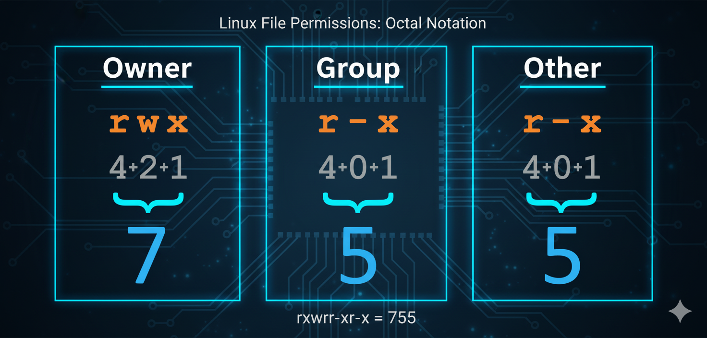

= 🔒 El Guardián de tus Archivos en Linux: Permisos y Propiedad 🛡️
Alex Callejas
:revdate: Oct 4, 2025
:sectnums:
:keywords: file management, permissions, ownership

En el mundo de *Linux*, la seguridad y la compartición de recursos se rigen por un sistema robusto y granular: los *permisos y la propiedad de archivos*. Entender este mecanismo es fundamental, no solo para aprobar exámenes como el *LPIC-1*, *LFCS* o *RHCSA*, sino para ser un administrador de sistemas competente.

== 👥 Propietarios, Grupos y Otros: ¿Quién tiene la llave?

Cada archivo y directorio en un sistema Linux tiene asignados tres categorías principales de usuarios a los que se aplican los permisos:

* *Propietario* (u - User/Owner): El usuario que creó el archivo (o a quien se le transfirió la propiedad). Suele tener el control total sobre los permisos.
* *Grupo* (g - Group): Un conjunto de usuarios. El archivo o directorio pertenece a un único grupo. Todos los miembros de ese grupo heredan los permisos asignados al grupo.
* *Otros* (o - Others): Cualquier usuario en el sistema que *no* es el propietario y *no* pertenece al grupo propietario del archivo.

Al listar archivos con el comando `ls -l`, verás una cadena de 10 caracteres que representa los permisos. El primer carácter indica el tipo de archivo (p. ej., `-` para un archivo normal, `d` para un directorio) y los 9 restantes están divididos en tres tríos que corresponden a los permisos para el *Propietario*, el *Grupo* y los *Otros*.

***

== 🔑 Permisos Básicos: Leer, Escribir y Ejecutar

Los permisos básicos son el núcleo del control de acceso:

[cols="1,1,1,2", options="header"]
|===
|Permiso | Símbolo (Simbólica) | Valor (Octal) | Función Principal
|*Lectura* | `r` | `4` | Permite ver el contenido del archivo o listar un directorio.
|*Escritura* | `w` | `2` | Permite modificar o eliminar el archivo, o crear/eliminar archivos dentro de un directorio.
|*Ejecución* | `x` | `1` | Permite ejecutar un archivo binario o script, o acceder a un directorio (entrar en él).
|*Sin Permiso* | `-` | `0` | No se permite la acción.
|===

=== Notación Simbólica y Octal

* *Simbólica:* Utiliza las letras `r`, `w`, `x` y los operadores `+` (añadir), `-` (quitar) e `=` (establecer). Por ejemplo, `u+x` añade permiso de ejecución al propietario.
* *Octal:* Es la suma de los valores numéricos. Un conjunto de permisos para una categoría se representa con un único dígito del 0 al 7.
** *Ejemplo:* **rwx** es **4+2+1=7**. **rw−** es **4+2+0=6**.

En la línea de comando podríamos verlo de la siguiente forma:

[source, bash]
----
$ ls -l ejemplo.txt 
-rwxr-xr-x. 1 acalleja acalleja 3426 Oct 3 12:06 ejemplo.txt
----

Donde podemos deducir lo siguiente:

* El *propietario* tiene permisos de *Lectura* (*r*), *Escritura* (*w)* y *Ejecución* (*x*).
* El *grupo* tiene permisos de *Lectura* (*r*) y *Ejecución* (*x*).
* *Otros* usuarios tienen permisos de *Lectura* (*r*) y *Ejecución* (*x*).

Por lo que, su notación octal sería: *755*, como lo muestra la siguiente imagen:

***

== 🛠️ Los Tres Comandos Mágicos: `chmod`, `chown` y `chgrp`

La administración de permisos y propiedad se realiza con tres comandos esenciales:

=== 1. `chmod` (Change Mode)

Se utiliza para modificar los *permisos* de un archivo o directorio.

* *Sintaxis Octal:* `chmod 640 archivo.txt` (Propietario: rw−, Grupo: r−−, Otros: −−−).
* *Sintaxis Simbólica:* `chmod g-w,o=r archivo.txt` (Quita escritura al grupo y establece solo lectura para otros).

=== 2. `chown` (Change Owner)

Se utiliza para cambiar el *propietario* (usuario) y/o el *grupo* propietario de un archivo.

* *Cambiar solo propietario:* `chown nuevo_usuario archivo.txt`
* *Cambiar propietario y grupo:* `chown nuevo_usuario:nuevo_grupo archivo.txt`

=== 3. `chgrp` (Change Group)

Se utiliza para cambiar el *grupo* propietario de un archivo de forma independiente.

* *Sintaxis:* `chgrp nuevo_grupo archivo.txt`

***

== 🚨 Permisos Especiales: SUID, SGID y Sticky Bit

Estos bits van más allá de los permisos básicos y otorgan capacidades especiales. Se representan con un dígito adicional al inicio de la notación octal (ej. `4755`) o con una letra diferente en el listado `ls -l`.

=== 1. SUID (Set User ID) - Valor 4

* *En Ejecutables:* Permite que un usuario ejecute el archivo con los permisos del *propietario* del archivo (a menudo `root`), no con los suyos propios. Es crucial para programas como `passwd`.
* *Símbolo:* Una `s` en la posición de `x` del Propietario.

=== 2. SGID (Set Group ID) - Valor 2

* *En Ejecutables:* Permite ejecutar el archivo con los permisos del *grupo* propietario.
* *En Directorios:* ¡Muy útil! Los archivos nuevos creados dentro de ese directorio heredarán el *grupo* del directorio, no el grupo principal del usuario creador. Ideal para directorios compartidos.
* *Símbolo:* Una `s` en la posición de `x` del Grupo.

=== 3. Sticky Bit - Valor 1

* *En Directorios:* Solo el *propietario* del archivo o el `root` puede *eliminar o renombrar* archivos dentro de ese directorio, incluso si otros usuarios tienen permiso de escritura (`w`) en el directorio. Esto previene que los usuarios eliminen los archivos de otros. El mejor ejemplo es el directorio `/tmp`.
* *Símbolo:* Una `t` en la posición de `x` de Otros.

*Ejemplo de* `chmod` *con bits especiales:* `chmod 2770 directorio_compartido` (Establece SGID y permisos rwxrwx−−−).

***

== 🎯 Más Allá: Listas de Control de Acceso (ACLs)

El modelo tradicional de permisos (Propietario, Grupo, Otros) a veces es demasiado limitado. ¿Qué pasa si necesitas darle permiso de escritura a un usuario, pero no a todo el grupo? Aquí entran en juego las *ACLs*.

Las *ACLs (Access Control Lists)* permiten definir permisos para *usuarios y grupos específicos* más allá de los tres básicos. Esto es especialmente importante en entornos empresariales y es un tema clave en el *RHCSA (RH134)* y *LFCS*.

=== Comandos Clave de ACLs

* `getfacl`: Muestra la ACL actual de un archivo o directorio.

[source, bash]
----
$ getfacl archivo.txt
----

* `setfacl`: Establece la ACL.

** *Dar permiso a un usuario específico (u:user:permisos):*

[source, bash]
----
$ setfacl -m u:ana:rw archivo.txt
----

** *Dar permiso a un grupo específico (g:group:permisos):*

[source, bash]
----
$ setfacl -m g:marketing:r-x archivo.txt
----

** *Quitar una ACL específica (-x):*

[source, bash]
----
$ setfacl -x u:ana archivo.txt
----

Cuando un archivo tiene una ACL, el listado `ls -l` mostrará un *símbolo* `+` al final de la cadena de permisos (ej: rwxr−xr−−+).

== 💡 Conclusión

Dominar los permisos y la propiedad es crucial para la seguridad y la colaboración efectiva en cualquier sistema Linux. Ya sea que estés preparándote para una certificación o administrando un servidor de producción, el conocimiento de `chmod`, `chown` y la versatilidad de las ACLs te dará el control total sobre tus recursos.

***

== Invitación a la Comunidad 🚀

Este *post* forma parte de una serie dedicada a la arquitectura y administración de sistemas Linux. ¡Queremos construir el mejor recurso posible *con tu ayuda*!

Te invitamos a:

* *Clonar el Repositorio:* El código fuente de todos nuestros artículos está disponible en *GitHub*.
* *Contribuir:* Si encuentras algún error, tienes sugerencias para mejorar la claridad de los conceptos o deseas proponer correcciones técnicas, no dudes en enviar un *Pull Request* (Solicitud de extracción).
* *Comentar:* ¿Tienes una pregunta o un punto de vista diferente sobre algún concepto? Abre un *Issue* (Incidencia) en el repositorio para iniciar la discusión.

Tu colaboración es vital para mantener este contenido preciso y actualizado.

*¡Encuentra el repositorio y participa aquí:* link:https://github.com/rootzilopochtli/introduccion-a-linux[github.com/rootzilopochtli/introduccion-a-linux]