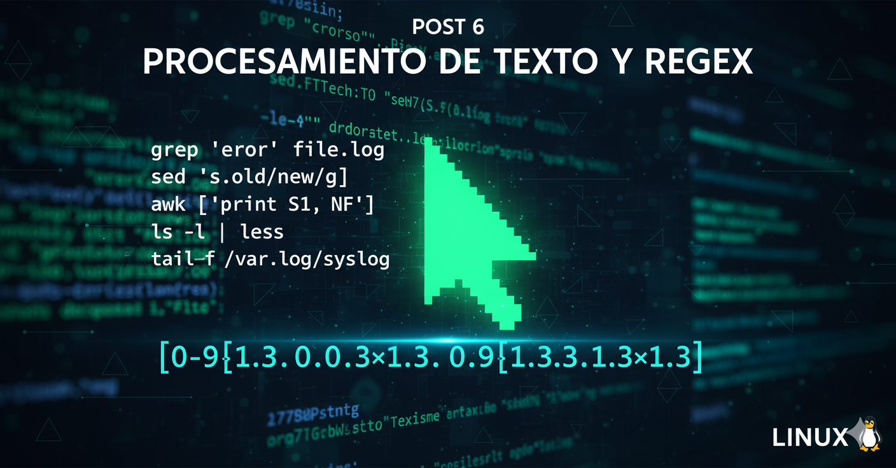
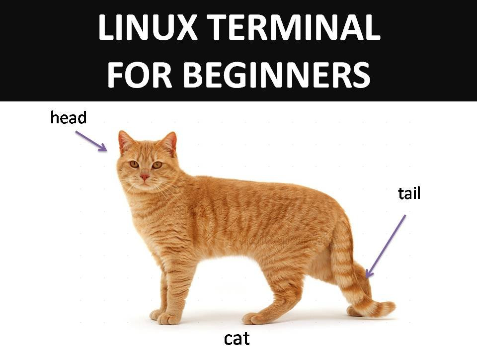

= ✍️ El Arte de Procesar Texto y Usar Expresiones Regulares en Linux
:author: Alex Callejas
:doctype: article
:revdate: Oct 7, 2025
:keywords: cat, head, tail, awk, regrexp, grep, sort, merge, join, cut

Linux, en su esencia, es un sistema operativo donde *todo es un archivo*. Desde un simple documento de texto hasta la configuración de un servicio complejo, la información a menudo se presenta en formato de texto plano. Dominar las herramientas de la línea de comandos para manipular y analizar este texto es una habilidad fundamental para cualquier administrador de sistemas o desarrollador. En esta entrada, exploraremos los comandos esenciales para la visualización, búsqueda y manipulación de texto, así como el poderoso mundo de las *expresiones regulares (regex)*.

== 🔎 Visualizando Archivos: Herramientas de un Vistazo

Antes de manipular, primero hay que ver. Linux nos ofrece una variedad de herramientas para visualizar el contenido de los archivos de manera rápida y eficiente, cada una con un propósito específico.

* `cat` (short for "concatenate"): Este comando es ideal para mostrar el contenido completo de archivos pequeños en la pantalla. Su uso principal es concatenar y mostrar archivos, pero en la práctica es muy usado para una simple y rápida visualización.
+
[source, bash]
----
cat /etc/os-release
----

* `less` y `more`: ¿Qué haces si un archivo es demasiado grande para caber en una sola pantalla? *`less`* y *`more`* son la respuesta. Permiten ver el contenido página por página.
** `more` te permite avanzar, pero no retroceder.
** `less` es más avanzado. Te permite avanzar y retroceder, buscar texto (`/`) y navegar de forma más flexible. Por eso, a menudo se prefiere `less` sobre `more`.

* `head` y `tail`: Como sus nombres lo indican, estos comandos muestran el principio (`head`) o el final (`tail`) de un archivo. Son extremadamente útiles para revisar logs o archivos de configuración grandes sin tener que verlos completos.
** `head -n 10 /var/log/syslog` : Muestra las primeras 10 líneas.
** `tail -f /var/log/nginx/access.log` : El *flag `-f`* es crucial. Muestra las últimas líneas del archivo y se mantiene "siguiéndolo", mostrando las nuevas líneas que se agregan en tiempo real. Esto es indispensable para monitorear logs en vivo.

Una forma muy sencilla de recordarlo, es referirse al meme:

Si quieres ver todo el gato (_archivo_): usa `cat`; si solo quieres ver el inicio, usa `head`; para solo ver el final, usa `tail`. 🤭

== 🔎 Búsqueda y Filtrado de Texto: El Poder de `grep`

*`grep`* (Global Regular Expression Print) es, sin lugar a dudas, uno de los comandos más usados en la línea de comandos de Linux. Su función es buscar líneas que coincidan con un patrón específico en uno o varios archivos.

* *Sintaxis básica*: `grep [opciones] 'patrón' [archivo...]`

* *Ejemplo simple*:
+
[source, bash]
----
grep 'error' /var/log/messages
----

* *Opciones comunes*:
** `-i`: Ignora mayúsculas y minúsculas.
** `-v`: Invierte la búsqueda. Muestra las líneas que *no* coinciden con el patrón.
** `-n`: Muestra el número de línea.
** `-r`: Búsqueda recursiva en subdirectorios.

== 🛠️ Manipulación Avanzada de Texto: El Trío de Ases

Aquí es donde entramos en el nivel experto. Los siguientes comandos no solo buscan, sino que también transforman y manipulan el texto.

* `sed` (Stream Editor): `sed` es un editor de flujo. No edita un archivo in-place por defecto, sino que lee línea por línea, aplica un conjunto de instrucciones y muestra el resultado. Es perfecto para *sustituciones y transformaciones* automáticas.
** *Sustitución básica*:
+
[source, bash]
----
sed 's/antiguo/nuevo/g' archivo.txt
----
*** `s`: Indica la operación de sustitución.
*** `g`: Global, para sustituir todas las ocurrencias en cada línea.

* `awk`: Este lenguaje de programación se especializa en procesar texto estructurado y trabajar con columnas o campos. `awk` es ideal para generar reportes, extraer información de logs y manipular datos tabulares.
** *Ejemplo*:
+
[source, bash]
----
ls -l | awk '{print $9, $5}'
----
*** Esto toma la salida de `ls -l` y para cada línea, imprime el noveno campo (nombre del archivo) y el quinto (tamaño).

* `vim` (Introducción): Aunque es un editor de texto por excelencia, *`vim`* es una poderosa herramienta para manipular texto. Su modo de comando y sus expresiones regulares integradas lo hacen muy eficiente para tareas complejas. Aprender las bases de `vim` es una inversión de tiempo que rinde frutos a largo plazo.

== 🤯 Expresiones Regulares (Regex): El Lenguaje de los Patrones

Las *expresiones regulares* no son un comando en sí, sino un lenguaje para describir patrones de búsqueda. Son la "magia" detrás de `grep`, `sed`, `awk` y muchos otros comandos. Dominar regex te permite buscar y manipular texto de formas increíblemente precisas.

=== 💡 Conceptos Clave

* *Caracteres literales*: Coinciden exactamente con el texto. Ej: `linux` coincide con la palabra "linux".
* *Anclas*: `^` (inicio de línea) y `$` (fin de línea).
** `^error`: Coincide con líneas que empiezan con "error".
** `error$`: Coincide con líneas que terminan con "error".
* *Metacaracteres y Clases de Caracteres*:
** `.`: Coincide con cualquier carácter (excepto salto de línea).
** `*`: Cero o más ocurrencias del carácter anterior.
** `+`: Una o más ocurrencias del carácter anterior.
** `?`: Cero o una ocurrencia del carácter anterior.
** `[ ]`: Clase de caracteres. `[aeiou]` coincide con cualquier vocal.
** `[0-9]`: Coincide con cualquier dígito.
** `[^ ]`: Excluye los caracteres. `[^0-9]` coincide con cualquier cosa que no sea un dígito.

=== ✍️ Ejemplo práctico

Digamos que quieres encontrar todas las direcciones IP en un archivo de log. Una regex simple sería:
+
[source, bash]
----
grep -E '[0-9]{1,3}\.[0-9]{1,3}\.[0-9]{1,3}\.[0-9]{1,3}' archivo.log
----
* `-E`: Activa las "extended regex", que son más flexibles.
* `[0-9]{1,3}`: Coincide con 1 a 3 dígitos.
* `\.`: El `\` escapa el `.` para que no signifique "cualquier carácter", sino el punto literal.

Dominar estas herramientas es un paso crucial en tu camino para convertirte en un profesional de Linux. ¡No te rindas si al principio parece complicado! La práctica constante es la clave para dominar este arte.

== 📚 Recursos Adicionales para Profundizar

Para aquellos que buscan ir más allá y prepararse para las certificaciones, aquí hay algunos recursos recomendados que cubren estos temas en profundidad:

* *Documentación oficial de GNU (Manuales `man`)*: Siempre el primer lugar para buscar. Usa `man <comando>` (ej. `man grep`, `man sed`, `man awk`) para la información más precisa y completa directamente desde tu sistema Linux.
** Enlace de referencia general (manuales GNU en línea): link:https://man7.org/linux/man-pages/index.html[GNU man pages online]

* *LPIC-1 (Examen 101 y 102)*:
** *Línea de comandos de Linux (The Linux Command Line by William Shotts)*: Un excelente libro gratuito en línea que cubre muchos de estos temas de forma práctica. Puedes encontrar capítulos dedicados a la manipulación de texto y expresiones regulares.
*** Enlace: link:http://linuxcommand.org/tlcl.php[The Linux Command Line - A Complete Introduction]
** *Guías de estudio LPIC-1*: Busca libros de referencia específicos para LPIC-1 que profundicen en "Processing Text Streams using filters" (Objetivo 103.7) y "Use `grep` and regular expressions to analyze text" (Objetivo 103.8).
*** Enlace de ejemplo (LPI Objectives 101-500): link:https://www.lpi.org/our-certifications/lpic-1-objectives/101-500-objectives[LPIC-1 Exam 101 Objectives] (Explora la sección de objetivos para 101 y 102).

* *LFCS (Linux Foundation Certified System Administrator)*:
** *Linux Journey*: Un buen recurso interactivo y gratuito para repasar fundamentos, incluyendo secciones de `grep`, `sed`, `awk` y regex.
*** Enlace: link:https://linuxjourney.com/[Linux Journey]
** *Documentación de Red Hat Enterprise Linux (RHEL)*: Muchos de los conceptos de LFCS se superponen con RHEL. Busca en la documentación oficial de RHEL guías sobre la administración de archivos y el uso de utilidades de texto.
*** Enlace de ejemplo (RHEL 8 documentation): link:https://access.redhat.com/documentation/en-us/red_hat_enterprise_linux/8[Red Hat Enterprise Linux 8 Documentation] (Busca "Text manipulation" o "Command line utilities").

* *RHCSA (RH104, RH124, RH134 - Red Hat Certified System Administrator)*:
** *Materiales oficiales de Red Hat*: Los cursos de Red Hat son la mejor fuente para la preparación. Presta especial atención a los módulos que cubren la manipulación de archivos y la búsqueda de patrones. (Requiere suscripción o acceso a cursos de Red Hat).
*** Enlace general (Red Hat Training): link:https://www.redhat.com/en/services/training-and-certification[Red Hat Training and Certification]
** *TutorialsPoint - Linux Utilities*: Contiene secciones dedicadas a `grep`, `sed`, `awk` con ejemplos prácticos muy útiles para entender cómo Red Hat espera que uses estas herramientas en un entorno empresarial.
*** Enlace: link:https://www.tutorialspoint.com/unix/unix_basic_utilities.htm[TutorialsPoint - Linux Basic Utilities] (Busca las secciones relevantes a `grep`, `sed`, `awk`).

¿Qué comando de procesamiento de texto es tu favorito o te ha sacado de un apuro? ¡Déjanos saber en los comentarios!

// Enlace de la publicación original (para versiones fuera de GitHub)
// link:https://www.rootzilopochtli.com/procesar-texto-y-usar-regex [Publicación Original del Blog]

***

== Invitación a la Comunidad 🚀

Este _post_ forma parte de una serie dedicada a la arquitectura y administración de sistemas Linux. ¡Queremos construir el mejor recurso posible **con tu ayuda**!

Te invitamos a:

* **Clonar el Repositorio:** El código fuente de todos nuestros artículos está disponible en **GitHub**.
* **Contribuir:** Si encuentras algún error, tienes sugerencias para mejorar la claridad de los conceptos o deseas proponer correcciones técnicas, no dudes en enviar un _Pull Request_ (Solicitud de extracción).
* **Comentar:** ¿Tienes una pregunta o un punto de vista diferente sobre algún concepto? Abre un _Issue_ (Incidencia) en el repositorio para iniciar la discusión.

Tu colaboración es vital para mantener este contenido preciso y actualizado.

**¡Encuentra el repositorio y participa aquí:** https://github.com/rootzilopochtli/introduccion-a-linux[github.com/rootzilopochtli/introduccion-a-linux]