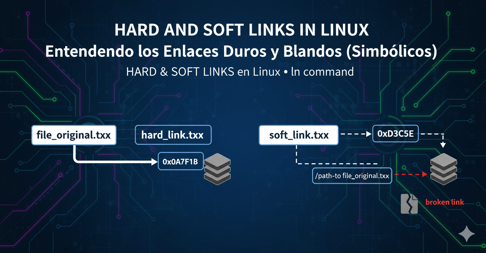

= Entendiendo los Enlaces Duros y Blandos (Simbólicos) en Linux 🔗
:author: Alex Callejas
:doctype: article
:revdate: Oct 8, 2025
:keywords: linux, links, hard-links, soft-links, ls, comandos

En Linux, los enlaces (links) son una característica fundamental que permite referenciar archivos o directorios desde múltiples ubicaciones. Dominar su uso es crucial para la administración de sistemas, ya que facilitan la organización, las copias de seguridad y la gestión de configuraciones. Existen dos tipos principales de enlaces: *enlaces duros* (hard links) y *enlaces blandos* o *simbólicos* (soft/symbolic links).

***

== 💡 Diferencia entre Enlaces Duros y Blandos

La diferencia principal radica en cómo se relacionan con la estructura del sistema de archivos, específicamente con el *inodo* (índice de nodo). El inodo es la estructura de datos que almacena toda la información sobre un archivo (permisos, propietario, fechas, bloques de datos en disco), excepto su nombre y el directorio que lo contiene.

[cols="3*", options="header"]
|===
| Característica | Enlace Duro (Hard Link) | Enlace Blando/Simbólico (Soft/Symbolic Link)
| *Concepto* | Es una *entrada de directorio adicional* que apunta al *mismo inodo* que el archivo original. | Es un *archivo nuevo y distinto* que contiene la *ruta* al archivo original.
| *Referencia* | Apunta directamente al *inodo* (los datos reales). | Apunta a la *ruta* (nombre del archivo) del archivo de destino.
| *Inodo* | *Comparte el mismo inodo* que el archivo original. | Tiene su *propio inodo* y permisos únicos.
| *Eliminación* | Al eliminar el archivo original, *el contenido persiste* mientras exista al menos un enlace duro apuntando al inodo (el contador de enlaces del inodo debe llegar a cero para que se elimine el archivo). | Al eliminar el archivo original, el enlace se *"rompe"* (se convierte en un *enlace colgante* o *dangling link*), ya que la ruta a la que apunta ya no existe.
| *Tipos de archivo* | Solo pueden enlazar *archivos*, no directorios (excepto como un privilegio de *superuser* o *root* en algunos sistemas, lo cual generalmente se desaconseja por seguridad y estabilidad). | Puede enlazar *archivos* y *directorios*.
| *Sistema de archivos* | *No pueden cruzar* los límites de los sistemas de archivos (particiones) porque el número de inodo solo es único dentro de un mismo sistema de archivos. | *Pueden cruzar* los límites de los sistemas de archivos.
| *Apariencia* | Aparece como un archivo regular, sin indicación especial en `ls -l`. El número en la columna de enlaces será mayor a 1. | Aparece con una `l` al inicio de la línea en `ls -l` y muestra la ruta de destino (`-> ruta`).
|===

*En resumen:*

* Un *Enlace Duro* es como tener varios nombres para un mismo archivo. Todos los nombres son igual de válidos y apuntan a los mismos datos. Si eliminas el nombre original, los datos persisten bajo los otros nombres.
* Un *Enlace Blando/Simbólico* es como un *acceso directo de Windows*. Apunta a la ubicación (ruta) de otro archivo. Si mueves o eliminas el archivo original, el acceso directo deja de funcionar.

<<<

== 🛠️ Uso del Comando `ln`

El comando principal para crear enlaces en Linux es `ln` (link).

La sintaxis general es:

[source, bash]
----
$ ln [OPCIONES] ARCHIVO_ORIGEN ENLACE_DESTINO
----

=== 1. Creación de Enlaces Duros

Por defecto, el comando `ln` crea un enlace duro (sin opciones).

*Sintaxis:*

[source, bash]
----
$ ln archivo_real.txt nuevo_enlace_duro.txt
----

*Ejemplo:*

1. Crea un archivo de prueba.

[source, bash]
----
$ echo "Contenido de prueba" > archivo_original.txt
----
2. Crea un enlace duro.

[source, bash]
----
$ ln archivo_original.txt enlace_duro.txt
----
3. Verifica el resultado (nota el mismo inodo en la primera columna y el contador de enlaces en 2):

[source, bash]
----
$ ls -li archivo_original.txt enlace_duro.txt
# Salida esperada (el inodo será el mismo, por ejemplo, 123456):
# 123456 -rw-r--r-- 2 user user 20 Oct 8 10:00 archivo_original.txt
# 123456 -rw-r--r-- 2 user user 20 Oct 8 10:00 enlace_duro.txt
----
4. Si editas `archivo_original.txt` o `enlace_duro.txt`, el cambio se refleja en ambos, porque están usando los mismos datos.

=== 2. Creación de Enlaces Blandos (Simbólicos)

Para crear un enlace simbólico, se utiliza la opción `-s` (*symbolic*).

*Sintaxis:*

[source, bash]
----
$ ln -s RUTA_A_ORIGEN enlace_simbolico.txt
----

*Nota Importante:* Es una buena práctica usar la *ruta absoluta* para el `ARCHIVO_ORIGEN` al crear enlaces simbólicos, especialmente para evitar enlaces rotos si el enlace se mueve a una ubicación diferente.

*Ejemplo:*

1. Crear un enlace simbólico (usando una ruta absoluta como ejemplo):

[source, bash]
----
$ ln -s /home/user/documento.txt mi_acceso.txt
----
2. Verificar el resultado (nota la `l` de *link* en los permisos y la flecha `->`):

[source, bash]
----
$ ls -li documento.txt mi_acceso.txt
# Salida esperada (los inodos serán diferentes):
# 789012 -rw-r--r-- 1 user user 20 Oct 8 10:05 documento.txt
# 987654 lrwxrwxrwx 1 user user 18 Oct 8 10:06 mi_acceso.txt -> /home/user/documento.txt
----

=== Opciones Comunes del Comando `ln`

[cols="2*", options="header"]
|===
| Opción | Descripción
| `-s` | Crea un enlace simbólico (blando).
| `-f` | Fuerza la eliminación de un archivo de destino existente (si el `ENLACE_DESTINO` ya existe) antes de crear el enlace.
| `-v` | Muestra el nombre de cada archivo enlazado (modo detallado o *verbose*).
| `-i` | Pregunta antes de sobrescribir archivos de destino existentes.
|===

<<<

== Casos de Uso Comunes 💼

* *Enlaces Duros:*
** Copias de Seguridad Incrementales: Herramientas como `rsync` o `cp -l` pueden usar enlaces duros para ahorrar espacio de almacenamiento. Si un archivo no ha cambiado, se crea un enlace duro a la copia anterior, no un duplicado completo.
** Acceso Múltiple al Archivo: Permite que un archivo sea visible en múltiples directorios del mismo sistema de archivos sin duplicar el contenido del disco.

* *Enlaces Blandos:*
** Atajos o Accesos Directos: Proporcionan un acceso fácil a archivos o directorios ubicados en rutas largas o complejas (similar a un acceso directo en otros sistemas operativos).
** Directorios o Particiones Diferentes: Permiten enlazar elementos entre sistemas de archivos.
** Sustitución de Versiones: Útiles para mantener un nombre de archivo constante que apunta a la versión más reciente, como en el caso de las bibliotecas. Por ejemplo, `libfoo.so -> libfoo.so.3.2`.

Entender la naturaleza de cada enlace y utilizar la opción correcta del comando `ln` es un conocimiento esencial y recurrente en los exámenes de certificación de Linux.

Para una explicación visual de cómo funcionan los enlaces duros y simbólicos, puedes ver el siguiente video: link:https://www.youtube.com/watch?v=FapBQOuASdo[ENLACES DUROS y ENLACES SIMBÓLICOS en LINUX].

// Enlace de la publicación original (para versiones fuera de GitHub)
// link:https://www.rootzilopochtli.com/entendiendo-los-enlaces-duros-y-blandos-simbolicos-en-linux [Publicación Original del Blog]

***

== Invitación a la Comunidad 🚀

Este *post* forma parte de una serie dedicada a la arquitectura y administración de sistemas Linux. ¡Queremos construir el mejor recurso posible *con tu ayuda*!

Te invitamos a:

* *Clonar el Repositorio:* El código fuente de todos nuestros artículos está disponible en *GitHub*.
* *Contribuir:* Si encuentras algún error, tienes sugerencias para mejorar la claridad de los conceptos o deseas proponer correcciones técnicas, no dudes en enviar un *Pull Request* (Solicitud de extracción).
* *Comentar:* ¿Tienes una pregunta o un punto de vista diferente sobre algún concepto? Abre un *Issue* (Incidencia) en el repositorio para iniciar la discusión.

Tu colaboración es vital para mantener este contenido preciso y actualizado.

*¡Encuentra el repositorio y participa aquí:* link:https://github.com/rootzilopochtli/introduccion-a-linux[github.com/rootzilopochtli/introduccion-a-linux]
