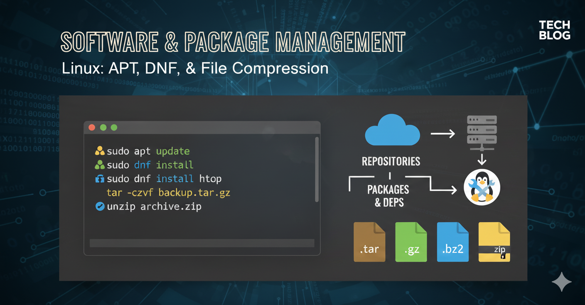
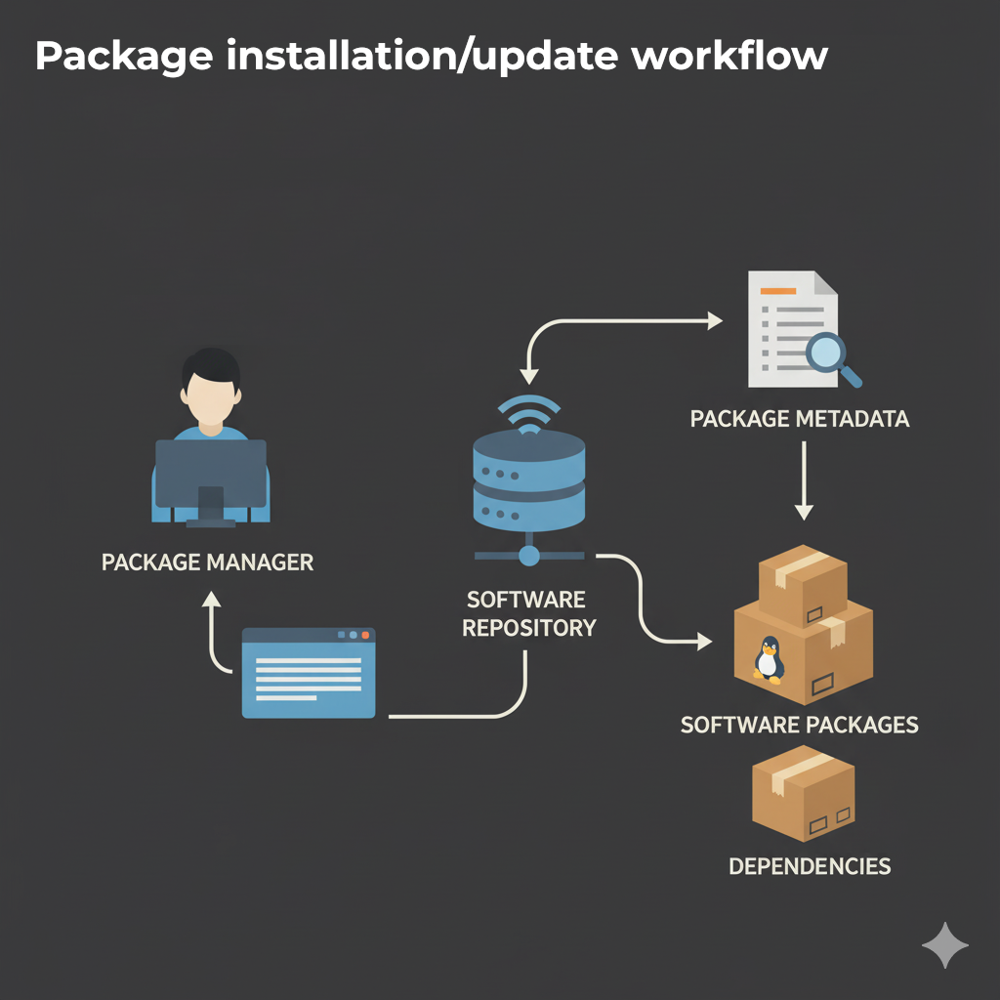

= Dominando la Administración de Software: APT, DNF y Archivos Comprimidos en Linux
Alex Callejas
:doctype: article
:revdate: Oct 13, 2025
:keywords: apt, dnf, package, rpm, dpkg, software, gzip, zip

En el mundo de la administración de sistemas Linux (base de LPIC, LFCS y RHCSA), la *gestión de software* es fundamental. Entender cómo funcionan los gestores de paquetes y cómo manejar archivos comprimidos es clave para mantener sistemas estables y actualizados.

== El Flujo de Instalación de Software: De Repositorio a Sistema Local

Instalar software en Linux a través de un gestor de paquetes no es solo descargar un archivo; es un proceso coordinado que garantiza la integridad, seguridad y correcto funcionamiento de la aplicación. Este es el flujo estándar que siguen herramientas como APT y DNF:

. *Invocación del Administrador:* El proceso comienza cuando el administrador de sistemas ejecuta un comando (ej., `apt install` o `dnf install`) para solicitar un paquete.
. *Conexión al Repositorio:* El administrador de paquetes se conecta, a través de la red, al *repositorio* configurado. Este es un servidor (local o en Internet) que actúa como un almacén central de todo el software disponible para la distribución.
. *Descarga de Metadatos (La 'Lista de Compras'):* Conforme la indicación (instalar o actualizar), el repositorio envía al sistema un archivo de *metadatos*. Estos metadatos son cruciales: contienen una lista de todos los paquetes disponibles, sus versiones y, lo más importante, sus *dependencias* (otros paquetes necesarios para que el software principal funcione).
** *Tip:* El comando de "actualizar" metadatos (ej. `apt update` o `dnf check-update`) simplemente compara estos metadatos remotos contra los que ya tiene el sistema de forma local, permitiendo al gestor saber qué *hay* de nuevo.
. *Solicitud de Confirmación:* El gestor de paquetes procesa la solicitud, calcula todas las dependencias necesarias y presenta al usuario la lista completa de paquetes a descargar e instalar/actualizar, solicitando una *confirmación* (`[Y/n]`).
** *⭐ Tip Avanzado de Buenas Prácticas*: Si has tenido problemas, es recomendable *limpiar la caché* de los metadatos locales (`apt clean` o `dnf clean all`) para forzar la descarga de información "fresca" del repositorio.
. *Descarga y Almacenamiento:* Una vez confirmada la acción, los paquetes binarios y sus dependencias se *descargan* del repositorio a una ubicación temporal en el disco local (la caché de paquetes).
. *Instalación/Actualización:* Los paquetes descargados son instalados o actualizados en el sistema.
. *Registro Local:* Finalmente, el gestor *actualiza su base de datos local* (`dpkg` o `RPM`) para registrar el paquete como instalado o actualizado, su versión y sus archivos, asegurando que el sistema sepa dónde encontrar y cómo gestionar ese software en el futuro.

== Diferencias Clave entre Gestores de Paquetes: APT, YUM y DNF

Los gestores de paquetes son herramientas que automatizan la instalación, actualización, configuración y eliminación de software, resolviendo automáticamente las dependencias. La principal diferencia entre ellos radica en el formato de paquete que utilizan y, por lo tanto, en la distribución de Linux donde se emplean:

[cols="1,1,1,1", options="header"]
|===
|Gestor |Distribución Principal |Formato de Paquete Base |Predecesor/Sucesor
|*APT* |Debian, Ubuntu, Mint |*.deb* (basado en DPKG) |Más nuevo que `apt-get`
|*YUM* |RHEL 6/7, CentOS 6/7, Fedora (antiguo) |*.rpm* (Red Hat Package Manager) |Predecesor de DNF
|*DNF* |RHEL 8+, CentOS Stream, Fedora (actual) |*.rpm* (Red Hat Package Manager) |Sucesor de YUM
|===

* *APT (Advanced Package Tool)*: Es el _front-end_ más moderno y fácil de usar para el sistema Debian (`dpkg`). Es conocido por su *estabilidad* y una excelente resolución de dependencias.
* *YUM (Yellowdog Updater Modified)*: Fue el gestor estándar en la familia Red Hat. Si bien es funcional, fue reemplazado por DNF.
* *DNF (Dandified YUM)*: Es la *próxima generación* de YUM. Ofrece un *rendimiento mejorado* y una *resolución de dependencias más rápida y precisa* (gracias al uso de la librería `libsolv`).

== Operaciones Prácticas: Instalación, Actualización y Eliminación

La sintaxis básica para las operaciones más comunes es muy similar, lo que facilita la transición entre sistemas. A continuación, se muestran ejemplos prácticos para instalar el paquete `htop` (un monitor de procesos interactivo).

[cols="1,1,1,2", options="header"]
|===
|Operación |Comando APT (Debian/Ubuntu) |Comando DNF (RHEL/Fedora/CentOS) |Descripción
|*Instalar* |`sudo apt install htop` |`sudo dnf install htop` |Instala el paquete y sus dependencias.
|*Eliminar* |`sudo apt remove htop` |`sudo dnf remove htop` |Elimina el paquete (mantiene archivos de configuración).
|*Purgar* |`sudo apt purge htop` |(No hay equivalente directo, `dnf remove` elimina la mayoría de archivos). |Elimina el paquete y sus archivos de configuración.
|*Actualizar* |`sudo apt update` `sudo apt upgrade` |`sudo dnf upgrade` |1. *Actualiza metadatos*. 2. Aplica las actualizaciones. (DNF combina el proceso en `upgrade`).
|*Limpieza* |`sudo apt autoremove` |`sudo dnf autoremove` |Elimina dependencias huérfanas o innecesarias.
|===

[[gestion-de-repositorios]]
== Gestión de Repositorios

Los *repositorios* son servidores remotos que alojan colecciones de paquetes. La gestión de repositorios es clave para saber dónde busca software tu sistema.

=== Gestión en Sistemas Basados en APT (Debian/Ubuntu)

Los repositorios se configuran principalmente en el archivo `/etc/apt/sources.list` y archivos individuales dentro del directorio `/etc/apt/sources.list.d/`.

* *Listar Repositorios:* Se inspeccionan los archivos mencionados.
* *Añadir un Repositorio:* Se edita el archivo `sources.list` o se usa el comando (común para PPAs):
  `sudo add-apt-repository ppa:<nombre_del_ppa>`
* *Actualizar Metadatos (Indispensable):*
  `sudo apt update`
  (¡Siempre haz un `update` después de modificar repositorios!)

=== Gestión en Sistemas Basados en DNF/YUM (RHEL/CentOS/Fedora)

Los repositorios se gestionan a través de archivos `.repo` ubicados en el directorio */etc/yum.repos.d/*.

* *Listar Repositorios (Habilitados):*
  `dnf repolist`
* *Habilitar/Deshabilitar Repositorio:*
  `sudo dnf config-manager --set-enabled epel`
  `sudo dnf config-manager --set-disabled updates`
* *Instalar Repositorio (ej. EPEL):*
  `sudo dnf install epel-release`

== Herramientas de Gestión de Archivos Comprimidos

En Linux, la compresión y el archivado a menudo se realizan en dos pasos, combinando una herramienta de archivado con una herramienta de compresión. *Archivar* significa agrupar muchos archivos; *comprimir* significa reducir el tamaño.

[cols="1,2,1,2", options="header"]
|===
|Herramienta |Función |Formato de Salida |Propiedad Clave
|*tar* |*Archivar* (Agrupa archivos en un solo fichero, sin compresión). |`.tar` |Se usa con compresores (`-z`, `-j`).
|*gzip* |*Comprimir* (Algoritmo rápido, usado con `tar`). |`.gz` (o `.tgz`) |Buena velocidad, compresión moderada.
|*bzip2* |*Comprimir* (Algoritmo lento pero con *mayor compresión* que `gzip`). |`.bz2` |Ideal cuando el tamaño es más importante que el tiempo.
|*zip* |*Archivar y Comprimir* (Comprime y agrupa al mismo tiempo). |`.zip` |Alta compatibilidad con sistemas Windows.
|===

=== Comandos Comunes con `tar`

El comando `tar` es la herramienta de facto para agrupar, a menudo combinado con opciones de compresión.

* *Crear* un archivo `.tar.gz`: `tar -czvf archivos.tar.gz /ruta/al/directorio`
* *Extraer* un archivo `.tar.bz2`: `tar -xjvf archivos.tar.bz2`
* *Listar* contenido de un `.tar.gz`: `tar -tzf archivos.tar.gz`

=== Comandos Comunes con `zip`

El comando `zip` es ideal para la *portabilidad* o cuando se trabaja en entornos mixtos.

* *Crear* un archivo `.zip` de un directorio: `zip -r archivos.zip /ruta/al/directorio`
* *Extraer* un archivo `.zip`: `unzip archivos.zip`

¡Dominar estas herramientas te dará el control total sobre el software en cualquier servidor Linux, preparándote para las certificaciones más exigentes!

Para una explicación más visual de las diferentes filosofías de gestión de paquetes, mira el siguiente video:

link:https://www.youtube.com/watch?v=5E_kURWBhr8[▶️ ¿Qué gestor de paquetes deberías usar? Pacman, APT y DNF explicados]

***

== Invitación a la Comunidad 🚀

Este *post* forma parte de una serie dedicada a la arquitectura y administración de sistemas Linux. ¡Queremos construir el mejor recurso posible *con tu ayuda*!

Te invitamos a:

* *Clonar el Repositorio:* El código fuente de todos nuestros artículos está disponible en *GitHub*.
* *Contribuir:* Si encuentras algún error, tienes sugerencias para mejorar la claridad de los conceptos o deseas proponer correcciones técnicas, no dudes en enviar un *Pull Request* (Solicitud de extracción).
* *Comentar:* ¿Tienes una pregunta o un punto de vista diferente sobre algún concepto? Abre un *Issue* (Incidencia) en el repositorio para iniciar la discusión.

Tu colaboración es vital para mantener este contenido preciso y actualizado.

*¡Encuentra el repositorio y participa aquí:* link:https://github.com/rootzilopochtli/introduccion-a-linux[github.com/rootzilopochtli/introduccion-a-linux]