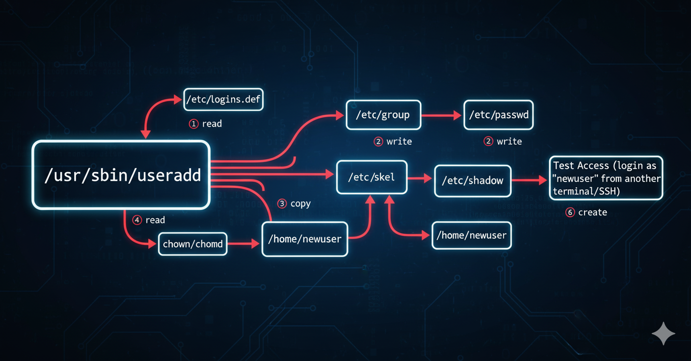

= Fundamentos de la Administración Linux - Gestión de Usuarios y Grupos 🧑‍💻🔒
Alex Callejas
:doctype: article
:revdate: Oct 9, 2025
:keywords: linux, root, sudo, user, group, administración

En el corazón de la administración de cualquier sistema operativo *Linux* se encuentra la gestión de sus usuarios y los grupos a los que pertenecen. Este control es fundamental para garantizar la *seguridad* y establecer los *permisos* de acceso a los recursos.

Si estás preparándote para certificaciones como *LPIC-1*, *LFCS* o *RHCSA*, dominar estas herramientas y entender los archivos de configuración subyacentes es crucial. ¡Vamos a sumergirnos!

== Gestión de Cuentas de Usuario

El ciclo de vida de un usuario en Linux se maneja principalmente a través de tres comandos: `useradd`, `usermod` y `userdel`.

=== 1. Creación de Usuarios (`useradd`)

El comando `useradd` (o `adduser` en algunas distribuciones) es la herramienta principal para crear una nueva cuenta. Por defecto, crea una entrada en `/etc/passwd`, establece el directorio *home* del usuario y, a menudo, crea un grupo primario con el mismo nombre que el usuario.

*Sintaxis básica:*

[source,bash]
----
$ sudo useradd nombre_usuario
----

*Opciones clave que debes conocer:*

* `-m`: *Crea* el directorio *home* del usuario si no existe (es la opción por defecto en muchos sistemas).
* `-g`: Especifica el *grupo primario* del usuario (por nombre o GID).
* `-G`: Especifica los *grupos secundarios* adicionales a los que pertenecerá el usuario (una lista separada por comas).
* `-c`: Agrega un *comentario* o descripción para la cuenta (por ejemplo, el nombre real del usuario).
* `-s`: Establece el *shell de inicio* del usuario (ejemplo: `/bin/bash` o `/sbin/nologin`).

=== 2. Modificación de Usuarios (`usermod`)

Cuando necesites cambiar los atributos de una cuenta existente, `usermod` es tu aliado.

*Sintaxis básica:*

[source,bash]
----
$ sudo usermod [OPCIONES] nombre_usuario
----

*Usos comunes de `usermod`:*

* Cambiar el directorio *home* y mover su contenido: `sudo usermod -m -d /nuevo/home nombre_usuario`
* Añadir un usuario a un grupo secundario: `sudo usermod -aG nombre_grupo nombre_usuario` (el modificador `-a` de **append** o añadir es importante para no sobrescribir los grupos existentes).
* Cambiar el nombre de usuario (¡peligroso!): `sudo usermod -l nuevo_nombre antiguo_nombre`

=== 3. Eliminación de Usuarios (`userdel`)

Para eliminar una cuenta de usuario, utiliza `userdel`.

*Sintaxis básica:*

[source,bash]
----
$ sudo userdel nombre_usuario
----

*Opción crucial:*

* `-r`: *Elimina* el directorio *home* y el *spool* de correo del usuario (se recomienda usar esta opción para una limpieza completa). `sudo userdel -r nombre_usuario`

== Gestión de Grupos en Linux

Los grupos son colecciones de usuarios que comparten los mismos *permisos* de acceso a un conjunto de archivos o recursos.

=== Comandos de Grupo

Al igual que con los usuarios, existen comandos equivalentes para gestionar los grupos:

* *`groupadd`*: Crea un nuevo grupo.
** Ejemplo: `sudo groupadd desarrollo`
* *`groupmod`*: Modifica las propiedades de un grupo.
** Ejemplo: `sudo groupmod -n nuevo_nombre_grupo antiguo_nombre_grupo` (cambiar el nombre)
* *`groupdel`*: Elimina un grupo.
** Ejemplo: `sudo groupdel desarrollo`

== Archivos Clave de Configuración 💾

Los comandos que acabamos de ver no hacen magia; simplemente modifican el contenido de tres archivos de texto planos esenciales. Conocer su estructura es vital para la resolución de problemas (troubleshooting).

=== 1. `/etc/passwd` (La Identidad)

Contiene la información básica y no sensible de la cuenta de usuario. Cada línea representa un usuario y se divide en *siete campos* separados por dos puntos (`:`):

[cols="3*", options="header"]
|===
| Campo | Descripción | Ejemplo
| *1.* Nombre de usuario | Nombre de inicio de sesión | `useradmin`
| *2.* Contraseña (x) | Suele ser una `x` indicando que la contraseña está en `/etc/shadow` | `x`
| *3.* ID de Usuario (**UID**) | Identificador único del usuario (0 es *root*) | `1001`
| *4.* ID de Grupo (**GID**) | ID del grupo primario | `1001`
| *5.* Comentario | Descripción o nombre completo | `Administrador de Sistemas`
| *6.* Directorio Home | Ruta donde inicia sesión el usuario | `/home/useradmin`
| *7.* Shell de Inicio | Programa que se ejecuta al iniciar sesión | `/bin/bash`
|===

=== 2. `/etc/shadow` (La Seguridad)

Almacena la información sensible de la contraseña. Solo el usuario *root* y los procesos con los permisos adecuados pueden leer este archivo por seguridad. Los campos más importantes son el segundo (la *contraseña cifrada*) y los campos de política de caducidad.

=== 3. `/etc/group` (Las Pertenencias)

Lista los grupos definidos en el sistema. Cada línea tiene cuatro campos separados por dos puntos (`:`):

1.  **Nombre del grupo**
2.  **Contraseña del grupo** (suele ser `x`)
3.  **GID** (ID único del grupo)
4.  **Lista de miembros** (usuarios que tienen este grupo como *secundario*, separados por comas)

== Elevación de Privilegios: `sudo` y `/etc/sudoers` 👑

Un principio fundamental de seguridad es el *Principio de Mínimo Privilegio*. Los administradores no deben usar la cuenta de `root` para las tareas diarias. En su lugar, utilizamos el comando **`sudo`** (Super User DO) para ejecutar comandos con privilegios de otro usuario (normalmente `root`) solo cuando es necesario.

=== Uso de `sudo`

Para ejecutar un comando como `root`, simplemente antepón `sudo` al comando:

[source,bash]
----
$ sudo systemctl restart apache2
----

Al usar `sudo` por primera vez en una sesión, se te pedirá tu propia *contraseña de usuario*, no la de `root`.

=== El Archivo `/etc/sudoers`

¿Cómo sabe el sistema qué usuarios pueden usar `sudo` y qué comandos están autorizados a ejecutar? La respuesta está en el archivo `/etc/sudoers`.

* *Edición segura*: *Nunca* edites `/etc/sudoers` directamente con un editor como `vi` o `nano`. Utiliza siempre el comando **`visudo`**. Este comando valida la sintaxis del archivo antes de guardarlo, previniendo errores que podrían bloquear la capacidad de elevar privilegios en el sistema.

* *Configuración común*: La forma más común de conceder permisos de `sudo` es añadiendo el usuario o un grupo (como el grupo `wheel` o `sudo` en algunas distribuciones) a este archivo, permitiéndoles ejecutar *cualquier* comando:

[source,bash]
----
%wheel ALL=(ALL) ALL
# O para un usuario específico:
useradmin ALL=(ALL) ALL
----

Esta línea se traduce como: "Los miembros del grupo `wheel` (o el usuario `useradmin`) pueden ejecutar comandos **en CUALQUIER _host_ de origen**, **como CUALQUIER usuario**, **ejecutando CUALQUIER comando**."

Dominar la gestión de usuarios y grupos es la base para administrar un sistema Linux seguro y bien organizado. ¡Practica estos comandos en tu laboratorio y estarás un paso más cerca de tu certificación!

== Ejercicio Avanzado: Creando un Usuario "Manualmente" (El Flujo de `useradd`)

Aunque `useradd` es la herramienta estándar, entender lo que sucede "bajo el capó" te dará una perspectiva mucho más profunda de cómo Linux gestiona las cuentas de usuario. Este ejercicio te guiará a través de los mismos pasos que el comando `useradd` realiza internamente.

*¡Advertencia Importante!* Este ejercicio es para fines **estrictamente educativos** en un entorno de laboratorio o máquina virtual. En un sistema de producción, **siempre** debes usar los comandos estándar (`useradd`, `passwd`, `groupadd`, `usermod`, etc.) para evitar errores de sintaxis, inconsistencias en el sistema o problemas de seguridad.

Para este ejercicio, todos los comandos y tareas deben ejecutarse con privilegios de **`root`** (ya sea directamente como `root` o utilizando `sudo`).

=== El Flujo de `useradd` Replicado Manualmente:

Cuando ejecutas el comando `useradd <nombre_usuario>`, el binario `/usr/sbin/useradd` realiza una serie de pasos. A continuación, vamos a replicar ese proceso manualmente para un nuevo usuario llamado `manualuser`.

***

.*Paso 0: Preparación (como `root`)*

Antes de empezar, abre una terminal y asegúrate de tener privilegios de `root` con `sudo`.

[source,bash]
----
$ sudo -i
----

***

.Paso 1: Lectura de Configuraciones por Defecto desde `/etc/login.defs`*

El comando `useradd` primero lee el archivo `/etc/login.defs` para obtener las configuraciones por defecto del sistema, como rangos de UID/GID, umask, y políticas de caducidad de contraseñas.

* *Tu tarea (exploración):* Revisa este archivo para familiarizarte con las configuraciones que `useradd` utilizaría.
+
[source,bash]
----
# grep -E "UID_MIN|GID_MIN|UMASK|PASS_MAX_DAYS|PASS_MIN_DAYS|PASS_MIN_LEN|PASS_WARN_AGE" /etc/login.defs
----
+
Anótate el `UID_MIN` y `GID_MIN` para usarlos en los siguientes pasos. Para este ejemplo, asumiremos que el siguiente UID/GID disponible para `manualuser` es `1001`.

***

.Paso 2: Creación de Entradas en Archivos Clave de Configuración*

Ahora, crearemos las entradas correspondientes para `manualuser` en los archivos `/etc/group`, `/etc/passwd` y `/etc/shadow`.

* *2a. Crear el Grupo Primario en `/etc/group`:*
`useradd` por defecto crea un grupo con el mismo nombre que el usuario y lo asigna como grupo primario. Vamos a crear el grupo `manualuser` con el GID `1001`.
+
[source,bash]
----
# echo "manualuser:x:1001:" >> /etc/group
# cat /etc/group | tail -n 1 <1>
----
+
<1> Para verificar.

* *2b. Crear la Entrada del Usuario en `/etc/passwd`:*
Aquí definimos la información básica del usuario. Usaremos el UID `1001`, el GID primario `1001`, y el shell `/bin/bash`.
+
[source,bash]
----
# echo "manualuser:x:1001:1001:Usuario Creado Manualmente:/home/manualuser:/bin/bash" >> /etc/passwd
# cat /etc/passwd | tail -n 1 <1>
----
+
<1> Para verificar.

* *2c. Crear la Entrada de la Contraseña en `/etc/shadow`:*
Esta es la parte más delicada. Necesitamos una contraseña cifrada. En lugar de cifrarla manualmente, podemos generar una vacía o usar una existente. Para simplificar, crearemos una entrada inicial y luego usaremos `passwd` para establecer la contraseña (como haría `useradd` o un administrador).
+
[source,bash]
----

# echo "manualuser:!:19000:0:99999:7:::" >> /etc/shadow <1><2><3>
# cat /etc/shadow | tail -n 1 <4><5>
----
+
<1> La cadena vacía "!" o "*" indica una cuenta bloqueada o sin contraseña, forzando a establecerla
<2> La "x" en /etc/passwd ya indica que la contraseña está en /etc/shadow.
<3> Aquí, usaremos una entrada temporal para que 'passwd' pueda trabajar con ella.
<4> El '!' significa que la cuenta está bloqueada o sin contraseña válida inicial.
<5> Para verificar.

***

.*Paso 3: Creación y Configuración del Directorio Home*

El directorio *home* es donde el usuario almacena sus archivos personales.

* *3a. Crear el Directorio Home:*
+
[source,bash]
----
# mkdir /home/manualuser
----

* *3b. Copiar Archivos de `/etc/skel`:*
`/etc/skel` contiene archivos de configuración por defecto (como `.bashrc`, `.profile`) que se copian al nuevo directorio *home*.
+
[source,bash]
----
# cp -r /etc/skel/. /home/manualuser/
----

* *3c. Establecer Permisos y Propiedad:*
El directorio *home* y su contenido deben pertenecer al nuevo usuario y su grupo primario, con permisos adecuados.
+
[source,bash]
----
# chown -R manualuser:manualuser /home/manualuser
# chmod 700 /home/manualuser <1>
ls -ld /home/manualuser <2>
----
+
<1> Permisos básicos: solo el usuario puede leer/escribir/ejecutar
<2> Para verificar

***

.*Paso 4: Establecer la Contraseña del Nuevo Usuario*

Aunque ya creamos la entrada en `/etc/shadow`, el cifrado de la contraseña real y la configuración de las políticas de caducidad se hace con el comando `passwd`.

[source,bash]
----
# passwd manualuser
----

Se te pedirá que introduzcas y confirmes una nueva contraseña para `manualuser`. Una vez hecha, `passwd` actualizará la línea de `manualuser` en `/etc/shadow` con la contraseña cifrada y los datos de caducidad.

**⭐ Tip Avanzado para Contraseñas:**
Para este ejercicio, si quieres evitar el paso interactivo de `passwd` y ya conoces la contraseña cifrada de un usuario existente (por ejemplo, `testuser`) puedes copiar y adaptar su línea de `/etc/shadow`.

1.  **Obtén la línea de un usuario existente:**
+
[source,bash]
----
# grep testuser /etc/shadow
----

    Esto te dará algo como: `testuser:$6$SALTCIFRADO$...:19000:0:99999:7:::`

2.  **Edita la entrada de `manualuser` en `/etc/shadow`:**
    Puedes usar `sed` o un editor de texto (con mucho cuidado) para reemplazar la `!` por la parte cifrada de la contraseña.
    Por ejemplo, si la parte cifrada de `testuser` es `$6$SALTCIFRADO$...`, la copiarías para `manualuser`.
    **¡MUCHO CUIDADO AL EDITAR `/etc/shadow`! Un error puede bloquear inicios de sesión.**
+
[source,bash]
----
# sed -i 's/^manualuser:!: manualuser:<HASH_DE_CONTRASEÑA_CIFRADA>:19000:0:99999:7:::/' /etc/shadow <1>
----
+
<1> # Ejemplo (reemplaza <HASH_DE_CONTRASEÑA_CIFRADA> con el hash real copiado)

    Si haces esto correctamente, la misma contraseña que usas para `testuser` (o el usuario de donde copiaste el hash) debería funcionar para `manualuser`.

***

.*Paso 5: Verificar el Acceso al Sistema*

Este es el paso más importante para asegurarnos de que todo el trabajo manual ha sido correcto. Para comprobarlo, debemos intentar iniciar sesión como `manualuser`.

* *Opción A: Desde otra terminal con SSH (Recomendado):*
Abre una nueva terminal (en tu máquina anfitriona o en otra VM) e intenta conectarte vía SSH. Esto simula un inicio de sesión real.
+
[source,bash]
----
$ ssh manualuser@<DIRECCIÓN_IP_DE_TU_SERVIDOR_LINUX>
----

    Ingresa la contraseña que estableciste en el Paso 4. Si el inicio de sesión es exitoso, ¡lo has logrado!

* *Opción B: Cambiar de usuario desde un usuario sin privilegios:*
Si no puedes usar SSH, puedes cambiar a un usuario sin privilegios administrativos (si tienes uno) y luego intentar `su` al nuevo usuario.
+
[source,bash]
----
# exit <1>
logout
$ su - manualuser
----
+
<1> Primero, sal de tu sesión de `root` si estás en ella.
<2> Desde tu usuario normal (no `root`), intenta cambiar al nuevo usuario.

    Ingresa la contraseña cuando se te solicite. Si accedes, puedes verificar que estás en su *home* con `pwd` y ver su UID/GID con `id`.

***

¡Felicidades! Has completado la creación manual de un usuario, entendiendo a fondo los componentes que `useradd` maneja por ti. Este es un conocimiento valioso para cualquier administrador de sistemas Linux.

¡Comparte tus resultados y cualquier desafío que hayas encontrado en los comentarios! Nos encantaría saber cómo te fue con este ejercicio.

***

== Invitación a la Comunidad 🚀

Este *post* forma parte de una serie dedicada a la arquitectura y administración de sistemas Linux. ¡Queremos construir el mejor recurso posible *con tu ayuda*!

Te invitamos a:

* *Clonar el Repositorio:* El código fuente de todos nuestros artículos está disponible en *GitHub*.
* *Contribuir:* Si encuentras algún error, tienes sugerencias para mejorar la claridad de los conceptos o deseas proponer correcciones técnicas, no dudes en enviar un *Pull Request* (Solicitud de extracción).
* *Comentar:* ¿Tienes una pregunta o un punto de vista diferente sobre algún concepto? Abre un *Issue* (Incidencia) en el repositorio para iniciar la discusión.

Tu colaboración es vital para mantener este contenido preciso y actualizado.

*¡Encuentra el repositorio y participa aquí:* link:https://github.com/rootzilopochtli/introduccion-a-linux[github.com/rootzilopochtli/introduccion-a-linux]
