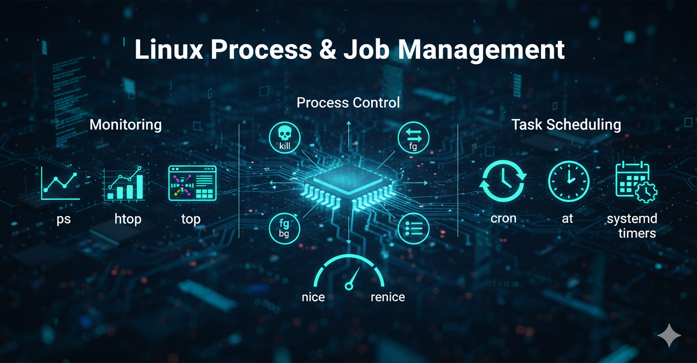

= Post 9: El Arte de la Gestión de Procesos y Trabajos en Linux 🛠️
:author: Alex Callejas
:doctype: article
:revdate: Oct 10, 2025
:keywords: linux, comandos, ps, top, htop, nice, renice, jobs, fg, bg, kill, cron, at, systemd timers

En el corazón de cualquier sistema operativo Linux latiendo constantemente, se encuentra la *gestión de procesos*. Un proceso no es más que una instancia de un programa en ejecución. Dominar cómo visualizarlos, controlarlos, ajustar su prioridad e incluso programar su ejecución es fundamental para la *administración eficiente del sistema* y es una habilidad clave evaluada en certificaciones como *LPIC-1*, *LFCS* y *RHCSA*.

***

== Visualización de Procesos: Tus Ojos en el Sistema 🧐

Saber qué está haciendo tu sistema es el primer paso para gestionarlo. Existen varias herramientas esenciales para obtener una "foto" o un "video" en tiempo real de los procesos:

* *ps* (Process Status): Proporciona una *instantánea* de los procesos en un momento dado. Es una herramienta poderosa con muchas opciones.
** Comandos comunes:
*** `ps -ef`: Similar a `aux`, utiliza un formato estilo UNIX/System V.
*** `ps -fp <PID>`: Muestra información detallada sobre un *Proceso ID* (PID) específico.
*** `ps aux`: Muestra todos los procesos, incluyendo los de otros usuarios.
*** `ps auxf`: Muestra todos los procesos, en formato de árbol de dependencia y herencia de procesos.
* *top*: Ofrece una *vista dinámica y en tiempo real* de los procesos, actualizándose continuamente. Muestra el uso de CPU y memoria de los procesos principales y permite interactuar con ellos (como terminar un proceso).
* *htop*: Una alternativa interactiva a `top` más amigable y con una mejor interfaz visual (usa colores y medidores de CPU/Memoria). Es *altamente recomendado* para la monitorización diaria.

***

== Control de Procesos y Trabajos: Manos a la Obra ✋

Una vez visualizados, necesitas herramientas para manipular los procesos y los *trabajos* (comandos ejecutados en la *shell*):

* *jobs*: Lista los trabajos que están siendo gestionados por la *shell* actual, mostrando su estado (detenido, ejecutándose) y el número de trabajo asociado.
* *fg* (Foreground): Trae un trabajo en segundo plano (background) o detenido al *primer plano* (foreground), permitiéndote interactuar con él. Se usa con el número de trabajo: `fg %1`.
* *bg* (Background): Reanuda un trabajo detenido o lo inicia en *segundo plano*, liberando la terminal para otros comandos. Se usa con el número de trabajo: `bg %1`.
** *Tip:* Para detener un proceso en primer plano, usa *Ctrl + Z*. Esto lo detendrá y podrás usar `bg` para continuarlo en segundo plano.
* *kill*: Envía una *señal* específica a un proceso o grupo de procesos utilizando su *PID*.
** Señales comunes:
*** `kill -9 <PID>` (*SIGKILL*): Fuerza la terminación del proceso de inmediato. *Úsese con precaución.*
*** `kill -15 <PID>` (*SIGTERM*): La señal de terminación por defecto. Solicita al proceso que finalice de manera ordenada.
* *killall*: Similar a `kill`, pero envía la señal a *todos los procesos con un nombre específico*, en lugar de usar el PID. Por ejemplo: `killall firefox`.

***

== Prioridad de Procesos: La Equidad del Sistema ⚖️

La prioridad determina la cantidad de tiempo de CPU que se asigna a un proceso. El valor de prioridad en Linux se llama *"Nice Value"* (Valor Nice), y se mide en un rango de *-20* (máxima prioridad) a *19* (mínima prioridad). El valor por defecto es *0*.

* *nice*: Se utiliza para *iniciar un nuevo proceso* con una prioridad no estándar.
** Ejemplo: `nice -n 10 <comando>` (inicia el comando con una prioridad más baja).
* *renice*: Se utiliza para *cambiar el Nice Value* de un proceso que ya está en ejecución.
** Ejemplo: `renice +5 -p <PID>` (disminuye la prioridad del proceso especificado).
** *Nota:* Solo el usuario `root` puede asignar un valor Nice más bajo que 0 (es decir, aumentar la prioridad).

***

== Programación de Tareas: Automatización al Poder 🤖

Para los administradores, la automatización es vital. Linux ofrece herramientas robustas para ejecutar comandos en momentos específicos:

=== 1. Programación Recurrente: `cron` (RH134/LFCS)

*cron* es el demonio de programación de tareas por excelencia, ideal para tareas *recurrentes y periódicas* (diarias, semanales, mensuales).

* `crontab -e`: Abre el archivo de configuración (*crontab*) del usuario actual para editar las tareas.
* Una entrada *crontab* tiene *cinco campos de tiempo* seguidos del comando a ejecutar:
+
[source,bash]
----
m h d M w comando
----
+
(minuto, hora, día del mes, mes, día de la semana)
+
** Ejemplo: `0 3 * * * /usr/bin/backup.sh` (Ejecuta el script de *backup* a las 3:00 AM todos los días).

=== 2. Programación de Tareas Únicas: `at` (RH134/LFCS)

*at* permite programar un comando o script para que se ejecute *una sola vez* en un momento específico en el futuro.

* *Uso:* Simplemente escribe `at <hora>` y luego ingresa los comandos en la línea de comandos, finalizando con *Ctrl + D*.
** Ejemplo: `at 2:00 PM tomorrow`
* `atq`: Muestra la cola de trabajos pendientes.
* `atrm <job ID>`: Elimina un trabajo de la cola.

***

== Systemd Timers: La Alternativa Moderna 💡

En sistemas que utilizan *Systemd* (como la mayoría de las distribuciones modernas), los *Timers de Systemd* son la alternativa moderna y recomendada para la programación recurrente. Son más robustos, permiten mejor gestión de dependencias y están mejor integrados con el resto de Systemd.

* En esencia, reemplazan a `cron` y consisten en dos archivos de unidad:
.. Un archivo *.service*: Define la acción o comando a ejecutar.
.. Un archivo *.timer*: Define cuándo y con qué frecuencia se debe ejecutar el servicio.

* *Gestión de Timers:*
** `systemctl enable <nombre>.timer`: Habilita el temporizador para que inicie en el arranque.
** `systemctl start <nombre>.timer`: Inicia el temporizador de inmediato.
** `systemctl list-timers --all`: Muestra todos los temporizadores, incluyendo el tiempo de la próxima ejecución.

Dominar estas herramientas no solo te permitirá aprobar las certificaciones, sino que te convertirá en un administrador de sistemas más competente y eficaz, capaz de mantener el rendimiento y la estabilidad de cualquier servidor Linux.

¿Cuál de estas herramientas utilizas más en tu día a día? ¡Déjanos un comentario!

// Enlace de la publicación original (para versiones fuera de GitHub)
// link:https://www.rootzilopochtli.com/gestion-de-procesos-y-tareas [Publicación Original del Blog]

***

== Invitación a la Comunidad 🚀

Este *post* forma parte de una serie dedicada a la arquitectura y administración de sistemas Linux. ¡Queremos construir el mejor recurso posible *con tu ayuda*!

Te invitamos a:

* *Clonar el Repositorio:* El código fuente de todos nuestros artículos está disponible en *GitHub*.
* *Contribuir:* Si encuentras algún error, tienes sugerencias para mejorar la claridad de los conceptos o deseas proponer correcciones técnicas, no dudes en enviar un *Pull Request* (Solicitud de extracción).
* *Comentar:* ¿Tienes una pregunta o un punto de vista diferente sobre algún concepto? Abre un *Issue* (Incidencia) en el repositorio para iniciar la discusión.

Tu colaboración es vital para mantener este contenido preciso y actualizado.

*¡Encuentra el repositorio y participa aquí:* link:https://github.com/rootzilopochtli/introduccion-a-linux[github.com/rootzilopochtli/introduccion-a-linux]
