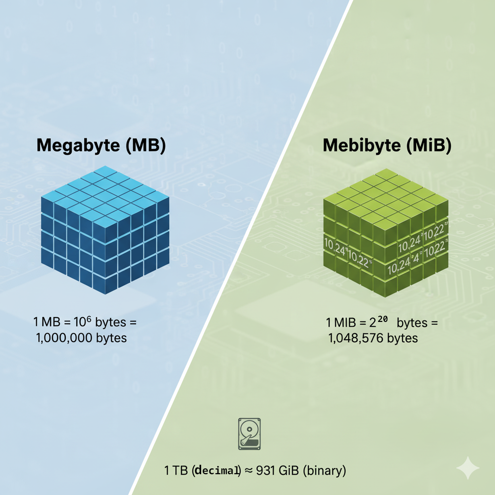

= Administración de Almacenamiento en Linux: Dispositivos, Particiones y Formateo 💾
:author: Alex Callejas
:doctype: article
:revdate: Oct 14, 2025
:keywords: storage, lsblk, particiones, formateo, gdisk, parted, fdisk, df, du

image::images/portada_11.png[Administración de Almacenamiento en Linux: Dispositivos, Particiones y Formateo 💾]

La gestión eficaz del almacenamiento es una habilidad fundamental para cualquier administrador de sistemas Linux. Las certificaciones como *LPIC-1*, *LFCS* y *RHCSA* ponen un gran énfasis en la capacidad de identificar dispositivos, crear particiones y aplicar el sistema de archivos adecuado. Este post cubre los comandos esenciales y las consideraciones clave en este proceso.

== Identificación de Dispositivos de Bloque

Antes de cualquier manipulación, es crucial identificar correctamente los dispositivos de almacenamiento. En Linux, estos se representan típicamente como archivos en el directorio `/dev`, como `/dev/sda`, `/dev/sdb`, y sus particiones numeradas (ej. `/dev/sda1`).

[cols="1,2,2,3", options="header"]
|===
| Comando
| Propósito Principal
| Tabla de Particiones
| Nota Clave

| `lsblk`
| Muestra los dispositivos de bloque en formato de árbol.
| Ambas (MBR/GPT)
| *Lectura* (solo muestra información, no modifica). Excelente para una visión rápida y limpia.

| `fdisk`
| Editor de particiones interactivo.
| *MBR* (principalmente)
| Herramienta clásica para MBR. Se usa con la opción `-l` para listar: `fdisk -l`.

| `gdisk`
| Editor de particiones interactivo.
| *GPT*
| La herramienta moderna para el estándar GPT (GUID Partition Table).

| `parted`
| Manipulador de tablas de particiones y particiones.
| Ambas (MBR/GPT)
| No interactivo por defecto, muy potente, soporta redimensionamiento de particiones y GPT.
|===

*Ejemplo de listado con `lsblk`:*

[source,bash]
----
$ lsblk
NAME   MAJ:MIN RM  SIZE RO TYPE MOUNTPOINT
sda      8:0    0  200G  0 disk
├─sda1   8:1    0    1G  0 part /boot
└─sda2   8:2    0  199G  0 part
  ├─vg00-lv_root 253:0    0   50G  0 lvm  /
  └─vg00-lv_home 253:1    0  149G  0 lvm  /home
sdb      8:16   0    5G  0 disk
----

El comando `lsblk` muestra claramente la jerarquía, indicando discos (`disk`), particiones (`part`) y volúmenes lógicos LVM (`lvm`).

== Creación de Particiones

La creación de particiones implica definir un espacio contiguo en el disco que se preparará para contener un sistema de archivos. El proceso general utiliza `fdisk` (para MBR) o `gdisk`/`parted` (para GPT o MBR).

=== Creación con `gdisk` (Recomendado para GPT)

GPT es el estándar moderno, superando las limitaciones de MBR (como el límite de 4 particiones primarias y el tamaño de disco de 2TB).

. *Iniciar `gdisk`*:
+
[source,bash]
----
# gdisk /dev/sdb
----

. *Comandos dentro de `gdisk`*:
  * *`p`*: Imprime la tabla de particiones actual.
  * *`n`*: Crea una nueva partición (new).
  * *`t`*: Cambia el tipo de partición (type, código *`8300`* para Linux filesystem).
  * *`w`*: Escribe los cambios al disco y sale (write). **¡Peligroso, no usar en discos productivos sin copia de seguridad!**

=== Creación con `parted` (Flexible para MBR/GPT)

Con `parted` se pueden crear tablas y particiones usando comandos no interactivos, ideal para scripts.

. *Crear tabla GPT (si es un disco nuevo)*:
+
[source,bash]
----
# parted /dev/sdb mklabel gpt
----

. *Crear una partición primaria (ej. de 1GB a 10GB)*:
+
[source,bash]
----
# parted /dev/sdb unit GiB mkpart primary 1 10
----

== Formateo y Sistemas de Archivos Comunes

Una vez creada la partición (ej. `/dev/sdb1`), esta debe ser *formateada* para crear un *Sistema de Archivos (FS)*, que organiza y gestiona los datos. El comando universal para formatear es *`mkfs`*, con variantes específicas para cada tipo de FS.

=== ext4 (Fourth Extended Filesystem)

*ext4* es el sistema de archivos por defecto más común en muchas distribuciones Linux. Es una evolución robusta y probada de ext3, con soporte para *journaling* (registro por diario) y archivos de hasta 16TB.

*Comando de Formateo:*

[source,bash]
----
# mkfs -t ext4 /dev/sdb1
# O su forma abreviada:
# mkfs.ext4 /dev/sdb1
----

=== XFS (Extended File System)

*XFS* es el sistema de archivos por defecto en Red Hat Enterprise Linux (RHEL) y sus derivados (como CentOS y Fedora). Está optimizado para escalabilidad, grandes volúmenes de datos y alto rendimiento en operaciones paralelas.

*Comando de Formateo:*

[source,bash]
----
# mkfs -t xfs /dev/sdb1
# O su forma abreviada:
# mkfs.xfs /dev/sdb1
----

_Tenga en cuenta: A diferencia de ext4, XFS es más difícil de reducir (achicar) una vez creado. Es mejor usar *XFS* para particiones de datos grandes, y *ext4* para el sistema raíz (`/`) o volúmenes más pequeños si no está en un entorno RHEL._

== Resumen del Flujo de Trabajo

La administración de almacenamiento sigue un patrón lógico de tres pasos:

. *Identificar el Disco* (`lsblk`, `fdisk -l`).
. *Particionar el Disco* (`fdisk`, `gdisk`, `parted`).
. *Formatear la Partición* (`mkfs.ext4`, `mkfs.xfs`).
. (Opcional, pero esencial) *Montar el Sistema de Archivos* (`mount`) y hacerlo persistente con `/etc/fstab`.

Dominar estas herramientas y flujos de trabajo es clave para superar los desafíos de las certificaciones técnicas y gestionar entornos de producción en Linux.

Aprende a particionar tu disco duro para Linux con esta link:https://www.youtube.com/watch?v=5jv5Mq9SFmc[Guía de instalación en 5 pasos].

== ⚠️ Importante: La Diferencia entre Megabyte (MB) y Mebibyte (MiB)

Para los administradores de sistemas, especialmente los novatos, la distinción entre Megabyte (MB) y Mebibyte (MiB) puede ser una fuente de confusión significativa al trabajar con almacenamiento y memoria. Aunque a menudo se usan indistintamente en el lenguaje coloquial, representan cantidades ligeramente diferentes.

=== Megabyte (MB) - Basado en Potencias de 10

El *Megabyte (MB)* utiliza el sistema decimal (base 10).

* 1 Kilobyte (KB) = 10^3 bytes = 1,000 bytes
* 1 Megabyte (MB) = 10^6 bytes = 1,000,000 bytes
* 1 Gigabyte (GB) = 10^9 bytes = 1,000,000,000 bytes

Este es el estándar que los fabricantes de discos duros suelen utilizar para anunciar la capacidad de sus productos.

=== Mebibyte (MiB) - Basado en Potencias de 2

El *Mebibyte (MiB)* utiliza el sistema binario (base 2), que es el preferido en informática para representar la memoria y el almacenamiento a nivel de software. Los prefijos "kibi", "mebi", "gibi", etc., fueron introducidos por la Comisión Electrotécnica Internacional (IEC) para evitar esta ambigüedad.

* 1 Kibibyte (KiB) = 2^10 bytes = 1,024 bytes
* 1 Mebibyte (MiB) = 2^20 bytes = 1,024 x 1,024 bytes = 1,048,576 bytes
* 1 Gibibyte (GiB) = 2^30 bytes = 1,024 x 1,024 x 1,024 bytes = 1,073,741,824 bytes

=== ¿Por qué es importante esta diferencia?

La diferencia entre estos dos sistemas es la razón por la que un disco duro de "1 Terabyte (TB)" (1,000,000,000,000 bytes) puede aparecer en tu sistema operativo como aproximadamente "931 GiB". El sistema operativo (y herramientas como `fdisk`, `lsblk` y `df`) suelen reportar el espacio en unidades binarias (GiB), mientras que los fabricantes usan unidades decimales (GB).

**Cálculo de ejemplo:**

* Un disco de 1 TB (decimal) = 1,000,000,000,000 bytes.
* En GiB, esto sería: 1,000,000,000,000 bytes / (1024^3) ≈ 931.32 GiB.

Comprender esta distinción es crucial para:

* **Evitar confusiones** sobre el espacio real disponible en un disco.
* **Calcular requisitos de almacenamiento** de manera precisa.
* **Interpretar correctamente la salida** de herramientas de Linux que reportan el tamaño de las particiones y el uso del disco en MiB, GiB, etc.

Siempre que sea posible, es una buena práctica utilizar los prefijos binarios (KiB, MiB, GiB) al referirse a la capacidad de almacenamiento y memoria en entornos técnicos para eliminar la ambigüedad.

// Enlace de la publicación original (para versiones fuera de GitHub)
// link:https://www.rootzilopochtli.com/administracion-de-almacenamiento [Publicación Original del Blog]

***

== Invitación a la Comunidad 🚀

Este *post* forma parte de una serie dedicada a la arquitectura y administración de sistemas Linux. ¡Queremos construir el mejor recurso posible *con tu ayuda*!

Te invitamos a:

* *Clonar el Repositorio:* El código fuente de todos nuestros artículos está disponible en *GitHub*.
* *Contribuir:* Si encuentras algún error, tienes sugerencias para mejorar la claridad de los conceptos o deseas proponer correcciones técnicas, no dudes en enviar un *Pull Request* (Solicitud de extracción).
* *Comentar:* ¿Tienes una pregunta o un punto de vista diferente sobre algún concepto? Abre un *Issue* (Incidencia) en el repositorio para iniciar la discusión.

Tu colaboración es vital para mantener este contenido preciso y actualizado.

*¡Encuentra el repositorio y participa aquí:* link:https://github.com/rootzilopochtli/introduccion-a-linux[github.com/rootzilopochtli/introduccion-a-linux]