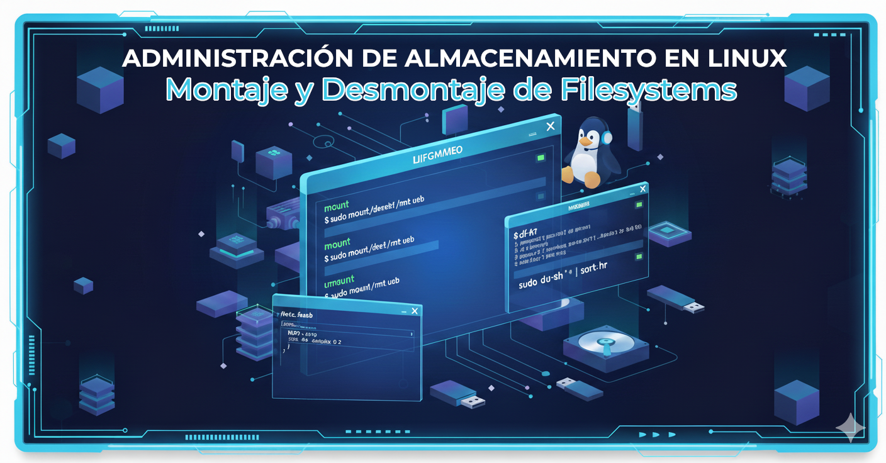

= Montaje y Desmontaje de Sistemas de Archivos en Linux
:author: Alex Callejas
:doctype: article
:revdate: Oct 15, 2025
:keywords: mount, umount, df, du

El manejo y la organización de datos son fundamentales en cualquier sistema operativo, y en Linux, esto se gestiona mediante el montaje y desmontaje de *sistemas de archivos*. Entender estos procesos es clave, como lo demuestran los currículos de certificaciones como *LPIC-1*, *LFCS* y *RHCSA*. En este post, exploraremos los comandos esenciales y la configuración para un montaje eficiente y persistente.

== 💾 Montaje y Desmontaje con `mount` y `umount`

Un sistema de archivos (como una partición de disco, un USB o un recurso compartido de red) debe estar *montado* en un *punto de montaje* (un directorio) para que sus datos sean accesibles para el sistema operativo y los usuarios.

### El comando `mount`

El comando `mount` conecta un sistema de archivos a la jerarquía de directorios de Linux.

*Sintaxis básica:*

[source,bash]
----
mount [opciones] dispositivo punto_de_montaje
----

*Ejemplos Comunes:*

1.  *Montar un dispositivo simple:* Si insertas una unidad USB (identificada como `/dev/sdb1`) y quieres acceder a su contenido en el directorio `/mnt/usb`:
+
[source,bash]
----
$ sudo mount /dev/sdb1 /mnt/usb
----
+
*Ver sistemas de archivos montados:* Para ver qué sistemas de archivos están actualmente activos (sin argumentos):
+
[source,bash]
----
 $ mount
 # o, mejor aún, para ver información desde el kernel
 $ cat /proc/mounts
----

2.  *Especificar el tipo de sistema de archivos:* Aunque Linux a menudo lo detecta, puedes especificarlo con la opción `-t` (útil para sistemas como NFS, ext4, XFS, etc.):
+
[source,bash]
----
 $ sudo mount -t nfs servidor:/ruta /mnt/nfs
----

> 💡 *Nota:* La mayoría de los sistemas modernos de escritorio gestionan automáticamente el montaje de dispositivos extraíbles, pero es esencial que los administradores de sistemas entiendan el proceso manual.

### El comando `umount`

El comando `umount` (sí, sin la 'n') es crucial para *desconectar* un sistema de archivos, asegurando que todos los datos en caché se escriban en el dispositivo antes de que se retire. *Nunca* desconectes físicamente un dispositivo sin desmontarlo primero, ya que podrías sufrir *corrupción de datos*.

*Sintaxis básica:*

[source,bash]
----
umount dispositivo
# O
umount punto_de_montaje
----

*Ejemplo:*

Para desmontar el USB montado anteriormente:

[source,bash]
----
$ sudo umount /mnt/usb
# O
$ sudo umount /dev/sdb1
----

Si el desmontaje falla con un error como *"target is busy"*, significa que un proceso o un usuario está accediendo a un archivo o tiene el directorio como su directorio de trabajo actual. Puedes usar `lsof | grep /mnt/usb` para identificar al culpable.

\== 📝 Montaje Persistente con `/etc/fstab`

Para que un sistema de archivos se monte automáticamente cada vez que el sistema arranca, debes configurarlo en el archivo **`/etc/fstab`** (filesystem table). Este archivo es fundamental para la estabilidad del sistema.

### Estructura de `/etc/fstab`

Cada línea en `/etc/fstab` representa un sistema de archivos que se va a montar y consta de seis campos, separados por espacios o tabulaciones:

[cols="1,2,1,2,1,1", options="header"]
|===
| Campo | Descripción | Ejemplo Típico
| *1* | Dispositivo (ruta, UUID o LABEL) | `/dev/sdb1` o `UUID=a9b3...`
| *2* | Punto de Montaje | `/home` o `/mnt/data`
| *3* | Tipo de Sistema de Archivos | `ext4` o `xfs` o `swap`
| *4* | Opciones de Montaje | `defaults` o `rw,nosuid,nodev`
| *5* | Dump (Backup) | `0` (no hacer dump) o `1` (hacer dump)
| *6* | Pass (Comprobación de Integridad) | `0` (no revisar) o `1`/`2` (revisar al inicio)
|===

*Ejemplo de una entrada:*

[source,bash]
----
UUID=a9b3c4d5-e6f7-80g9-h0i1-j2k3l4m5n6o7  /data  xfs  defaults  0  2
----

*Puntos clave:*

  * **Identificación del dispositivo (Campo 1):** Es mejor usar **UUID** (Identificador Único Universal) en lugar de `/dev/sdXn`, ya que el orden de los dispositivos puede cambiar al reiniciar. Puedes encontrar los UUID con el comando `blkid`.
  * **Opciones (Campo 4):**
      * `defaults`: Incluye `rw` (lectura/escritura), `suid` (permite SUID), `dev` (permite dispositivos), `exec` (permite la ejecución de binarios), `auto` (se monta automáticamente al inicio), `nouser` (solo root puede montar/desmontar) y `async`.
      * `noauto`: Evita que se monte automáticamente al arrancar.
      * `user`: Permite a cualquier usuario montar y desmontar el sistema de archivos.

### Prueba después de la edición

Después de editar `/etc/fstab`, es vital probar la configuración *sin reiniciar*. Puedes pedirle a `mount` que monte todas las entradas de `fstab` que aún no estén montadas:

[source,bash]
----
$ sudo mount -a
----

Si hay un error en `fstab`, aparecerá aquí. Si reinicias con un error crítico, el sistema podría no arrancar correctamente.

\== 📈 Supervisión del Espacio en Disco: `df` y `du`

Como administrador, es esencial saber cuánto espacio libre queda en el disco y qué directorios están ocupando más espacio. Para esto, usamos dos comandos de uso frecuente.

### 1\. `df` (Disk Free)

El comando `df` muestra la cantidad de espacio libre y usado de los sistemas de archivos montados.

*Opciones esenciales:*

  * `-h`: **H**uman-readable (legible por humanos). Muestra los tamaños en G (Gigabytes), M (Megabytes), etc.
  * `-T`: Muestra el **T**ipo de sistema de archivos (ej. `xfs`, `ext4`).

*Ejemplo:*

[source,bash]
----
$ df -hT

Filesystem     Type   Size  Used Avail Use% Mounted on
/dev/sda2      ext4    50G  6.5G   41G  14% /
tmpfs          tmpfs  3.9G     0  3.9G   0% /dev/shm
/dev/sdb1      xfs     98G   50M   93G   1% /mnt/data
----

La columna **Use%** te da un indicador rápido de los sistemas de archivos que se están quedando sin espacio.

### 2\. `du` (Disk Usage)

Mientras que `df` opera a nivel de sistema de archivos, `du` estima el espacio utilizado por un conjunto específico de archivos o *directorios*.

*Opciones esenciales:*

  * `-h`: **H**uman-readable.
  * `-s`: **S**ummarize (resumir). Muestra un total para el directorio o archivo.

*Ejemplo (para encontrar los directorios más grandes):*

1.  Ve al directorio que quieres analizar:
+
[source,bash]
----
 $ cd /var/log
----

2.  Muestra el tamaño total de cada subdirectorio, ordenado del más grande al más pequeño:
+
[source,bash]
----
 $ sudo du -sh * | sort -hr

 150M  journal
 8.2M  apt
 4.0K  httpd
 ...
----
+
Este comando es crucial para la *limpieza del disco* y la *resolución de problemas de espacio*.

***

Dominar los comandos `mount`, `umount`, la configuración de `/etc/fstab` y las herramientas de supervisión de espacio (`df` y `du`) son habilidades fundamentales que un administrador de Linux debe tener. Practica estos comandos en tu laboratorio virtual para asegurar tu éxito en el examen de certificación. ¡Feliz administración\!

// Enlace de la publicación original (para versiones fuera de GitHub)
// link:https://www.rootzilopochtli.com/montaje-y-desmontaje-de-fs [Publicación Original del Blog]

***

== Invitación a la Comunidad 🚀

Este *post* forma parte de una serie dedicada a la arquitectura y administración de sistemas Linux. ¡Queremos construir el mejor recurso posible *con tu ayuda*!

Te invitamos a:

* *Clonar el Repositorio:* El código fuente de todos nuestros artículos está disponible en *GitHub*.
* *Contribuir:* Si encuentras algún error, tienes sugerencias para mejorar la claridad de los conceptos o deseas proponer correcciones técnicas, no dudes en enviar un *Pull Request* (Solicitud de extracción).
* *Comentar:* ¿Tienes una pregunta o un punto de vista diferente sobre algún concepto? Abre un *Issue* (Incidencia) en el repositorio para iniciar la discusión.

Tu colaboración es vital para mantener este contenido preciso y actualizado.

*¡Encuentra el repositorio y participa aquí:* link:https://github.com/rootzilopochtli/introduccion-a-linux[github.com/rootzilopochtli/introduccion-a-linux]
