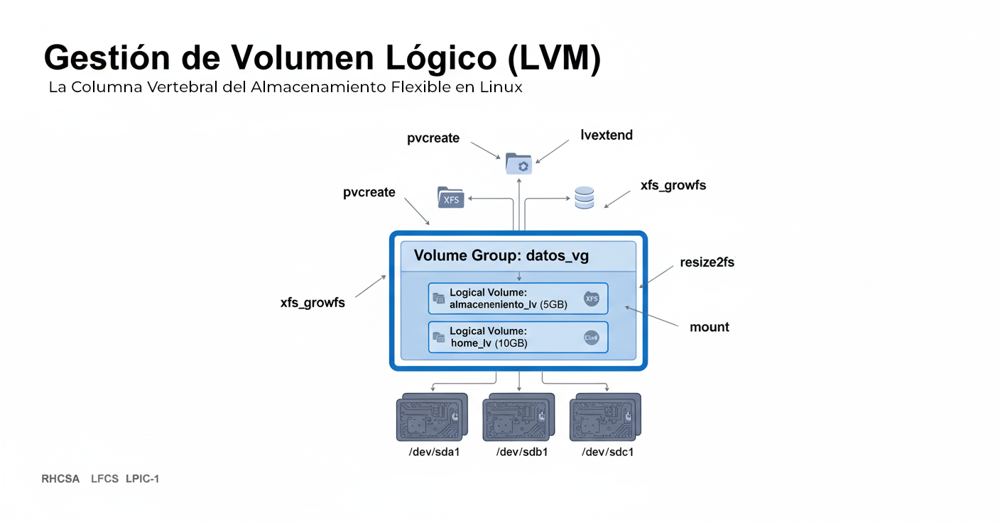

= Gestión de Volumen Lógico (LVM): La Columna Vertebral del Almacenamiento Flexible en Linux
Alex Callejas
:doctype: article
:revdate: Oct 16, 2025
:keywords: LVM, Linux, RHCSA, LFCS, LPIC-1, Almacenamiento, SysAdmin
:description: Un post detallado sobre la Gestión de Volumen Lógico (LVM) en Linux, cubriendo PV, VG, LV, creación, gestión y ampliación de sistemas de archivos.

La *Gestión de Volumen Lógico (LVM)* es una herramienta esencial que todo administrador de sistemas Linux debe dominar. Ofrece una flexibilidad de almacenamiento que el particionamiento tradicional de discos no puede igualar, permitiéndote redimensionar, mover y tomar instantáneas de volúmenes de forma dinámica.

Tanto si estás preparando el examen *RHCSA* (cuyo enfoque práctico en Red Hat Enterprise Linux, como se ve en el curso RH134, lo convierte en un tema central) como el *LFCS* o el más generalista *LPIC-1*, el entendimiento y la práctica de LVM son fundamentales.

== 1. Los Conceptos Clave de LVM: PV, VG y LV 🧱

LVM introduce una capa de abstracción sobre el hardware físico. Imagina que tu almacenamiento es un juego de LEGO, donde las piezas se combinan en diferentes niveles para crear estructuras flexibles.

[cols="1,2,2,4",options="header"]
|===
|Acrónimo |Concepto |Analogía |Descripción
|*PV* |*Volumen Físico (Physical Volume)* |Ladrillos individuales de LEGO. |Un disco duro, una partición de disco o un RAID que ha sido inicializado para que LVM pueda usarlo. Es el componente de almacenamiento base.
|*VG* |*Grupo de Volúmenes (Volume Group)* |Un cubo o caja que contiene los ladrillos. |Una colección de uno o más *PV*s. Actúa como un _pool_ de almacenamiento, combinando el espacio de múltiples dispositivos físicos en una única unidad lógica.
|*LV* |*Volumen Lógico (Logical Volume)* |La estructura final construida con los ladrillos. |Una "partición virtual" que se crea a partir del espacio libre en un *VG*. Es el dispositivo que formateas con un sistema de archivos (como XFS o Ext4) y montas para su uso.
|===

La ventaja clave es que el *LV* ya no está atado a la ubicación física de un disco (PV). Si un LV necesita más espacio, simplemente lo tomas del pool de almacenamiento (VG), que puede ampliarse añadiendo más discos físicos (PVs) sin tener que redimensionar particiones físicas.

== 2. Creación y Gestión Básica de Volúmenes Lógicos 🛠️

El proceso para crear un volumen lógico utilizable sigue una secuencia lógica de tres pasos principales. Usaremos `/dev/sdb` como nuestro disco sin usar y crearemos un volumen de 5 GB para un directorio de datos, asumiendo que el disco ya ha sido particionado con el tipo LVM (`8e` en `fdisk`).

=== Paso 1: Crear los Volúmenes Físicos (PV)

Inicializa tu disco o partición para que LVM pueda reconocerlo.

[source,bash]
----
# Inicializa el dispositivo como un PV
$ sudo pvcreate /dev/sdb1

# Verifica el nuevo PV
$ sudo pvdisplay /dev/sdb1
----

=== Paso 2: Crear el Grupo de Volúmenes (VG)

Combina uno o más PVs en un pool de almacenamiento.

[source,bash]
----
# Crea un VG llamado 'datos_vg' usando el PV
$ sudo vgcreate datos_vg /dev/sdb1

# Verifica el nuevo VG
$ sudo vgdisplay datos_vg
----

=== Paso 3: Crear y Formatear el Volumen Lógico (LV)

Crea la "partición virtual" que usarás.

[source,bash]
----
# Crea un LV de 5 GB llamado 'almacenamiento_lv' dentro de 'datos_vg'
$ sudo lvcreate -L 5G -n almacenamiento_lv datos_vg

# Verifica el nuevo LV
$ sudo lvdisplay datos_vg/almacenamiento_lv
----

El dispositivo lógico creado estará disponible en una ruta similar a `/dev/datos_vg/almacenamiento_lv` o `/dev/mapper/datos_vg-almacenamiento_lv`.

=== Paso 4: Formatear y Montar

Para poder usar el LV, debes formatearlo con un sistema de archivos (XFS o Ext4) y luego montarlo.

[source,bash]
----
# Formatea el LV con XFS (común en RHCSA)
$ sudo mkfs.xfs /dev/datos_vg/almacenamiento_lv

# Crea un punto de montaje y monta el LV
$ sudo mkdir /datos_empresariales
$ sudo mount /dev/datos_vg/almacenamiento_lv /datos_empresariales

# Para que el montaje sea persistente, añade una entrada a /etc/fstab:
# /dev/mapper/datos_vg-almacenamiento_lv /datos_empresariales xfs defaults 0 0
----

Para que el montaje sea persistente, añade una entrada a /etc/fstab:
`/dev/mapper/datos_vg-almacenamiento_lv /datos_empresariales xfs defaults 0 0`

== 3. La Habilidad Imprescindible: Ampliación de Sistemas de Archivos 🚀

La gran ventaja de LVM es su capacidad de redimensionamiento "en caliente" (mientras está montado y en uso, dependiendo del sistema de archivos). Esto es un requisito común en los exámenes de certificación.

Para ampliar un LV y el sistema de archivos asociado, el proceso tiene dos fases:

=== Fase 1: Extender el Volumen Lógico (LV)

Supongamos que el VG `datos_vg` todavía tiene espacio libre. Puedes usar el comando `lvextend` para añadir más espacio al LV `almacenamiento_lv`.

*Añadir una cantidad específica (ej. 3 GB más):*

[source,bash]
----
$ sudo lvextend -L +3G /dev/datos_vg/almacenamiento_lv
----

*Ocupar todo el espacio libre restante en el VG (opción muy común en exámenes):*

[source,bash]
----
$ sudo lvextend -l +100%FREE /dev/datos_vg/almacenamiento_lv
----

El LV ya tiene el nuevo tamaño, pero el sistema de archivos (XFS/Ext4) _aún no lo sabe_.

=== Fase 2: Redimensionar el Sistema de Archivos

Este paso hace que el sistema operativo y el sistema de archivos reconozcan el nuevo espacio en el LV. El comando varía según el sistema de archivos:

==== A. Para Sistemas de Archivos XFS (Estándar en RHCSA)

XFS es muy simple de redimensionar, ya que solo se puede extender y lo hace en caliente (montado).

[source,bash]
----
$ sudo xfs_growfs /datos_empresariales
----

*Nota:* Debes usar el *punto de montaje* (`/datos_empresariales`) con `xfs_growfs`, no el nombre del dispositivo.

==== B. Para Sistemas de Archivos Ext2/3/4 (Común en LFCS/LPIC-1)

Para Ext4, puedes usar el nombre del dispositivo. Se puede extender en caliente (montado).

[source,bash]
----
$ sudo resize2fs /dev/datos_vg/almacenamiento_lv
----

=== Comprobación Final

Finalmente, verifica que el sistema de archivos ha reconocido el nuevo espacio:

[source,bash]
----
$ df -h /datos_empresariales
----

Verás que el tamaño del sistema de archivos ha aumentado a 8 GB (el original de 5 GB más los 3 GB que añadimos).

¡Felicidades! Acabas de realizar una tarea fundamental de administración de sistemas que es un requisito indispensable en certificaciones como *RHCSA* y *LFCS*. Dominar LVM no solo te ayuda a aprobar, sino que te convierte en un administrador mucho más eficiente y preparado para entornos empresariales.

***

== Invitación a la Comunidad 🚀

Este *post* forma parte de una serie dedicada a la arquitectura y administración de sistemas Linux. ¡Queremos construir el mejor recurso posible *con tu ayuda*!

Te invitamos a:

* *Clonar el Repositorio:* El código fuente de todos nuestros artículos está disponible en *GitHub*.
* *Contribuir:* Si encuentras algún error, tienes sugerencias para mejorar la claridad de los conceptos o deseas proponer correcciones técnicas, no dudes en enviar un *Pull Request* (Solicitud de extracción).
* *Comentar:* ¿Tienes una pregunta o un punto de vista diferente sobre algún concepto? Abre un *Issue* (Incidencia) en el repositorio para iniciar la discusión.

Tu colaboración es vital para mantener este contenido preciso y actualizado.

*¡Encuentra el repositorio y participa aquí:* link:https://github.com/rootzilopochtli/introduccion-a-linux[github.com/rootzilopochtli/introduccion-a-linux]