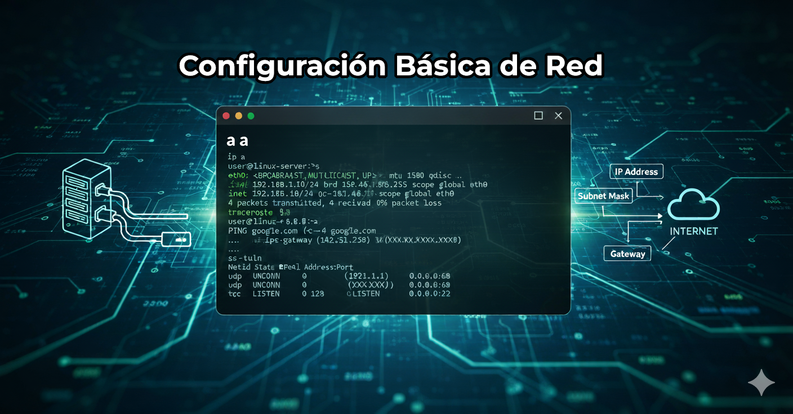

= Configuración Básica de Red en Linux: El Corazón de la Conectividad 🌐
:author: Alex Callejas
:doctype: article
:revdate: Oct 17, 2025
:keywords: Networking, Linux, RHCSA, LFCS, SysAdmin, ip, nmcli, NetworkManager

Si estás preparándote para certificaciones fundamentales de Linux como *LPIC-1*, *LFCS* o los módulos de *RHCSA* (RH104, RH124, RH134), la configuración de red es un pilar esencial. Una máquina que no se comunica es, en esencia, una isla. Dominar la configuración básica y las herramientas de diagnóstico es crucial para cualquier administrador de sistemas.

En este post, vamos a desglosar los conceptos clave y cómo aplicarlos en tu sistema Linux.

== Fundamentos de Red: IP, Máscara y Gateway 🧱

Para que dos dispositivos puedan "hablar" en una red, necesitan una identidad única y reglas para saber dónde termina su red local. Aquí es donde entran en juego tres conceptos fundamentales:

=== 1. Dirección IP (Internet Protocol)
Es la *identidad única* de tu dispositivo dentro de la red. Piensa en ella como tu dirección postal. En la práctica actual, nos centramos en *IPv4* (ejemplo: `192.168.1.10`) o *IPv6*.

=== 2. Máscara de Red (Netmask)
La máscara de red define *qué parte de la dirección IP pertenece a la red* y *qué parte identifica al host* (el dispositivo). Es como el código postal que agrupa a varias casas en la misma zona.

* *Notación CIDR:* En los sistemas Linux modernos, a menudo se usa la notación _Classless Inter-Domain Routing_ (CIDR). En lugar de escribir la máscara completa (`255.255.255.0`), se indica con una barra diagonal y el número de bits que representan la red (ejemplo: `192.168.1.10/24`). El `/24` equivale a `255.255.255.0`.

=== 3. Gateway o Puerta de Enlace (Default Gateway)
Es la dirección IP del *dispositivo (usualmente un router) que permite a tu red local comunicarse con redes externas* (como Internet u otras subredes). Si tu dispositivo necesita enviar un paquete a una IP que está *fuera* de tu red local, se lo envía primero al Gateway.

== Configuración de Red: Temporal vs. Persistente ⚙️

Como administrador, debes saber cómo aplicar una configuración de red tanto de forma inmediata para una prueba, como de forma permanente para el uso diario.

=== Configuración Temporal (Sólo hasta el Reinicio)

Utilizamos la herramienta moderna `ip` para establecer una configuración que *se pierde al reiniciar* el servicio de red o el sistema operativo. Esto es útil para pruebas rápidas.

|===
| Tarea | Comando (con `ip`)

| *Verificar IP*
| `ip a` (o `ip address show`)

| *Asignar IP/Máscara*
| `ip addr add 192.168.1.10/24 dev eth0`

| *Eliminar IP*
| `ip addr del 192.168.1.10/24 dev eth0`

| *Asignar Gateway*
| `ip route add default via 192.168.1.1 dev eth0`
|===

=== Configuración Persistente (Archivos de Configuración)

Para que la configuración sobreviva a los reinicios, debe guardarse en *archivos de configuración* que son leídos por el gestor de red (como *NetworkManager* o *systemd-networkd*).

* *Sistemas basados en Red Hat/CentOS/Fedora (RHCSA):*
    * La configuración se almacena tradicionalmente en archivos bajo el directorio `/etc/sysconfig/network-scripts/`.
    * Cada interfaz tiene un archivo `ifcfg-nombre_interfaz` (ej. `ifcfg-eth0`).
    * Las variables clave incluyen: `BOOTPROTO=static|dhcp`, `IPADDR`, `NETMASK` (o `PREFIX`), y `GATEWAY`.

* *Sistemas basados en Debian/Ubuntu (LPIC-1/LFCS):*
    * La configuración puede encontrarse en `/etc/network/interfaces` para el antiguo gestor de red.
    * O, más comúnmente en sistemas modernos, a través de archivos de configuración para *Netplan* (en `/etc/netplan/*.yaml`) o *systemd-networkd* (en `/etc/systemd/network/`).

[NOTE]
====
*Consejo de Examen:* En RHCSA, debes estar cómodo editando los archivos `ifcfg-*` o, dependiendo de la versión, usando herramientas como `nmcli` o `nmtui` para interactuar con NetworkManager. En LPIC/LFCS, dominar `ip` y la configuración de DHCP/estática es primordial.
====

== Herramientas Esenciales de Diagnóstico de Red 🛠️

Una vez configurada la red, necesitas herramientas para probar, diagnosticar y monitorear la conectividad.

|===
| Herramienta | Uso Principal | Ejemplos de Uso | Reemplaza a...

| *`ip`*
| *Configuración y visualización* de direcciones, rutas y dispositivos.
| `ip a`, `ip r` (rutas)
| `ifconfig`, `route`

| *`ping`*
| *Prueba básica de conectividad* a nivel de IP (ICMP).
| `ping 8.8.8.8`
| N/A

| *`ss`*
| *Visualización de _sockets_* (conexiones activas, escuchando). Rápido y moderno.
| `ss -tuln` (TCP/UDP, escuchando, numérico)
| `netstat`

| *`netstat`*
| *Visualización de conexiones, tablas de ruteo e interfaces*. (Herramienta heredada).
| `netstat -rn` (rutas), `netstat -tulpn` (conexiones)
| N/A (parcialmente por `ss` y `ip`)

| *`host`*
| *Búsqueda DNS simple* (nombre a IP y viceversa).
| `host google.com`
| N/A (más simple que `dig`)

| *`dig`*
| *Herramienta avanzada de consulta DNS* para diagnóstico detallado.
| `dig +short google.com`, `dig -x 8.8.8.8` (consulta inversa)
| N/A

| *`traceroute`*
| *Muestra la ruta* (lista de *hops* o saltos) que toma un paquete para alcanzar un destino, usando ICMP.
| `traceroute google.com`
| N/A

| *`tracepath`*
| Similar a `traceroute`, pero *no requiere privilegios de root* y a menudo descubre la *MTU* (Unidad Máxima de Transmisión) en el camino.
| `tracepath google.com`
| N/A
|===

=== El Diagnóstico Básico
Un administrador de sistemas sigue estos pasos ante un problema de red:

1.  *Verificar la interfaz:* ¿Está levantada? (`ip a`).
2.  *Probar el loopback:* `ping 127.0.0.1`. Si esto falla, el stack TCP/IP local tiene problemas.
3.  *Probar la IP propia:* `ping <mi_ip>`. Si falla, hay un problema en la configuración de la interfaz.
4.  *Probar el Gateway:* `ping <gateway_ip>`. Si falla, no puedes salir de la red local.
5.  *Probar una IP externa:* `ping 8.8.8.8`. Si falla pero el Gateway funciona, el problema está más allá del router local (ISP, etc.).
6.  *Probar un nombre externo (DNS):* `ping google.com`. Si la IP externa funciona pero el nombre no, el problema es el *servicio DNS*.

Dominar estas herramientas y el flujo de diagnóstico no solo te ayudará a aprobar los exámenes, sino que te convertirá en un solucionador de problemas de red mucho más eficiente. ¡A practicar!

// Enlace de la publicación original (para versiones fuera de GitHub)
// link:https://www.rootzilopochtli.com/configuracion-basica-de-red [Publicación Original del Blog]

***

== Invitación a la Comunidad 🚀

Este *post* forma parte de una serie dedicada a la arquitectura y administración de sistemas Linux. ¡Queremos construir el mejor recurso posible *con tu ayuda*!

Te invitamos a:

* *Clonar el Repositorio:* El código fuente de todos nuestros artículos está disponible en *GitHub*.
* *Contribuir:* Si encuentras algún error, tienes sugerencias para mejorar la claridad de los conceptos o deseas proponer correcciones técnicas, no dudes en enviar un *Pull Request* (Solicitud de extracción).
* *Comentar:* ¿Tienes una pregunta o un punto de vista diferente sobre algún concepto? Abre un *Issue* (Incidencia) en el repositorio para iniciar la discusión.

Tu colaboración es vital para mantener este contenido preciso y actualizado.

*¡Encuentra el repositorio y participa aquí:* link:https://github.com/rootzilopochtli/introduccion-a-linux[github.com/rootzilopochtli/introduccion-a-linux]