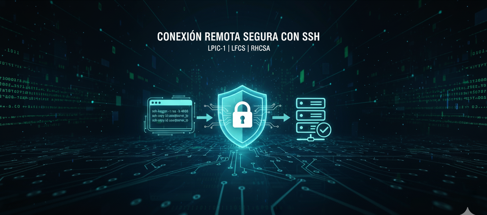
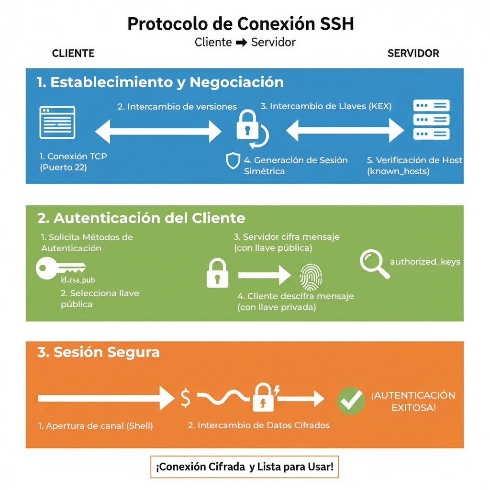

= 🚀 Desbloquea la Seguridad: Tu Guía Esencial de SSH (LPIC-1, LFCS, RHCSA)
:author: Alex Callejas
:doctype: article
:revdate: Oct 20, 2025
:keywords: ssh, remote, login, terminal, sshd, ssh-keygen, ssh-copy-id



¡Conéctate sin miedo! 🔐 El acceso remoto seguro con *SSH* es una habilidad fundamental para cualquier administrador de sistemas Linux, un tema clave en los exámenes *LPIC-1*, *LFCS* y *RHCSA*. Olvídate de protocolos inseguros como Telnet: SSH cifra toda tu sesión, protegiéndote de interceptaciones.

***

== 1. Uso del Cliente SSH para la Conexión Remota

*SSH* (*Secure Shell*) es el protocolo estándar para establecer un canal de comunicación cifrado y seguro entre un cliente y un servidor. El programa cliente se llama sencillamente `ssh`.

=== Sintaxis Básica de Conexión

Para iniciar una conexión remota desde tu terminal, usa el siguiente formato:

```
ssh [opciones] [usuario]@[host_remoto]
```

|===
| Componente | Descripción | Ejemplo
| `[usuario]` | El nombre de usuario en el sistema remoto al que se desea acceder. | `administrador`
| `[host_remoto]` | La dirección IP o el nombre de dominio/host del servidor. | `192.168.1.5` o `servidorweb.com`
| Comando Completo | | `ssh administrador@192.168.1.5`
|===

[NOTE]
====
*_✨ Consejo Pro:* Si tu nombre de usuario local es el mismo que el usuario remoto, puedes omitirlo: `ssh 192.168.1.5`._
====

=== Opciones Comunes del Cliente SSH

El cliente `ssh` soporta varias opciones esenciales que debes conocer:

|===
| *Opción* | *Descripción*
| `-p [puerto]` | Especifica un puerto diferente al predeterminado (*22*). Una práctica de seguridad habitual es cambiarlo.
| `-X` o `-Y` | Habilita el *Reenvío X11* (_X11 Forwarding_). Permite ejecutar aplicaciones con interfaz gráfica (GUI) del servidor y verlas en tu escritorio local.
| `-i [archivo_clave]` | Especifica el archivo de la *clave privada* para la autenticación por clave, si no está en la ubicación por defecto.
|===

***

== 2. Desglose de los Pasos de la Conexión SSH (Protocolo)

El proceso de conexión SSH es una secuencia de intercambio de información y cifrado entre el cliente (`ssh`) y el servidor (`sshd`, el demonio SSH).



=== Fase 1: Establecimiento y Negociación de la Conexión (Capa de Transporte)

1.  *Conexión TCP*: El *Cliente* inicia una conexión TCP al puerto 22 (por defecto) del *Servidor*.
2.  *Intercambio de Versiones*: Cliente y Servidor intercambian sus versiones de protocolo y acuerdan la versión más alta que ambos soporten (generalmente SSH-2).
3.  *Intercambio de Claves (KEX)*: Ambos sistemas intercambian sus listas de algoritmos de cifrado, *hashes* y claves de host. Usando el algoritmo Diffie-Hellman, negocian y generan una *clave simétrica de sesión*. *Esta clave nunca se transmite*; se utiliza para cifrar toda la comunicación posterior.
4.  *Verificación de Host*: El *Cliente* verifica la *Clave de Host* del *Servidor* (la "huella digital") contra el archivo local `~/.ssh/known_hosts`. Esto protege contra ataques _Man-in-the-Middle_.

=== Fase 2: Autenticación del Cliente

Una vez que el canal seguro y cifrado está activo, el servidor pide al cliente que demuestre su identidad.

1.  *Solicitud de Autenticación*: El *Servidor* informa al *Cliente* sobre los métodos de autenticación disponibles (contraseña, clave pública, etc.).
2.  *Selección del Método*: El *Cliente* elige la autenticación por *clave pública* (si existe el par de claves en `~/.ssh/`). Envía al *Servidor* un mensaje indicando que quiere autenticarse con la clave pública específica (`id_rsa.pub`).
3.  *Verificación y Desafío*:
    * El *Servidor* busca la clave pública en el archivo `~/.ssh/authorized_keys` del usuario remoto.
    * Si la encuentra, el *Servidor* genera un mensaje aleatorio y lo cifra con la *clave pública*.
    * El *Servidor* envía el mensaje cifrado de vuelta al *Cliente*.
4.  *Respuesta y Autenticación*:
    * El *Cliente* utiliza su *clave privada* para descifrar el mensaje y devuelve el texto original al Servidor.
    * Si el texto descifrado coincide con el mensaje aleatorio original, el Servidor confirma que el Cliente es legítimo.

=== Fase 3: Sesión e Intercambio de Datos

1.  *Apertura de Canal*: El Servidor concede acceso y el Cliente solicita la apertura de un *canal de sesión* (la *shell* de comando).
2.  *Sesión Interactiva*: El Servidor presenta el *prompt* al usuario.
3.  *Comunicación Cifrada*: Toda la comunicación, entradas y salidas, se ejecuta de forma segura a través del canal cifrado con la clave de sesión simétrica.

***

== 3. Generación y Uso de Pares de Claves SSH (Sin Contraseña)

La autenticación con par de claves es el método más seguro y conveniente, ya que permite la conexión *sin necesidad de contraseña*.

=== 1. Generar el Par de Claves (en el Cliente)

El comando `ssh-keygen` crea un par de claves basado en *criptografía asimétrica* (clave pública/privada).

`ssh-keygen -t rsa -b 4096`

* `-t rsa`: Especifica el algoritmo (RSA es común, pero *Ed25519* es una alternativa moderna).
* `-b 4096`: Establece la longitud de la clave a 4096 bits para mayor seguridad.
* *Sin Contraseña*: Para lograr la conexión *sin contraseña* (lo solicitado), cuando se te solicite la *Passphrase* (frase de contraseña), simplemente presiona *Enter dos veces* para dejarla vacía.

[NOTE]
====
Las claves se guardarán por defecto en el directorio *`~/.ssh/`*. La *clave privada* es `id_rsa` y la *pública* es `id_rsa.pub`. _Nunca compartas tu clave privada_.
====

=== 2. Copiar la Clave Pública al Servidor

La *clave pública* (`id_rsa.pub`) debe ser transferida al servidor remoto e insertada en el archivo `~/.ssh/authorized_keys` del usuario remoto. El método más eficiente es con `ssh-copy-id`:

`ssh-copy-id usuario@host_remoto`

Este comando se encarga de:

1.  Conectarse al servidor (por única vez, pidiendo la contraseña).
2.  Asegurar que el directorio `~/.ssh/` y el archivo `authorized_keys` existan y tengan los *permisos correctos* (esto es crítico para SSH).
3.  Añadir tu clave pública a la lista de claves autorizadas en el servidor.

=== 3. Conexión sin Contraseña

Una vez completado el paso anterior, intenta la conexión nuevamente. El cliente `ssh` detectará automáticamente la clave privada y la utilizará para autenticarse.

```
ssh usuario@host_remoto
# ¡Acceso inmediato y seguro, sin necesidad de teclear la contraseña!
```

Dominar SSH no solo es un requisito para aprobar tus certificaciones, sino que también es una práctica esencial en el mundo real para una administración de sistemas eficiente y segura. ¿Estás listo para migrar todas tus conexiones a la autenticación por claves?

// Enlace de la publicación original (para versiones fuera de GitHub)
// link:https://www.rootzilopochtli.com/guia-esencial-de-ssh [Publicación Original del Blog]

***

== Invitación a la Comunidad 🚀

Este *post* forma parte de una serie dedicada a la arquitectura y administración de sistemas Linux. ¡Queremos construir el mejor recurso posible *con tu ayuda*!

Te invitamos a:

* *Clonar el Repositorio:* El código fuente de todos nuestros artículos está disponible en *GitHub*.
* *Contribuir:* Si encuentras algún error, tienes sugerencias para mejorar la claridad de los conceptos o deseas proponer correcciones técnicas, no dudes en enviar un *Pull Request* (Solicitud de extracción).
* *Comentar:* ¿Tienes una pregunta o un punto de vista diferente sobre algún concepto? Abre un *Issue* (Incidencia) en el repositorio para iniciar la discusión.

Tu colaboración es vital para mantener este contenido preciso y actualizado.

*¡Encuentra el repositorio y participa aquí:* link:https://github.com/rootzilopochtli/introduccion-a-linux[github.com/rootzilopochtli/introduccion-a-linux]