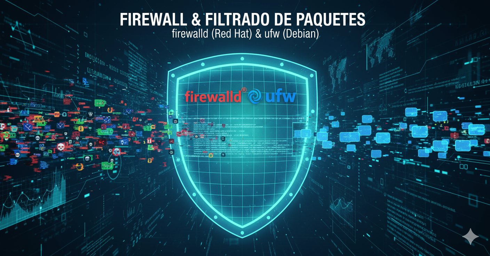
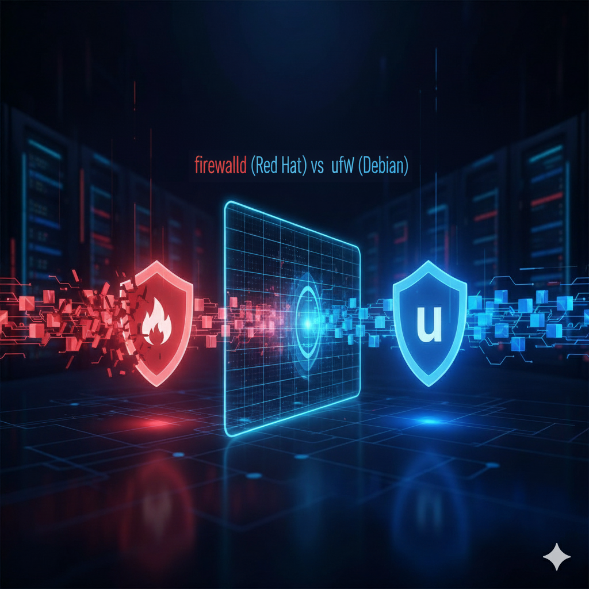

= Introducción a la Seguridad y el Firewall: El Guardián de tu Sistema Linux 🔒
:author: Alex Callejas
:doctype: article
:revdate: Oct 21, 2025
:keywords: firewall, ufw, firewalld, nftables

Si estás preparándote para certificaciones de Linux como *LPIC-1*, *LFCS* o *RHCSA*, la seguridad de la red es un tema clave. El pilar fundamental de esta seguridad a nivel de sistema es el *firewall* (cortafuegos). En este post, desglosaremos qué es, cómo funciona el filtrado de paquetes y te mostraremos configuraciones simples usando las herramientas más comunes: *firewalld* (Red Hat/CentOS) y *ufw* (Debian/Ubuntu).

---

== El Concepto Básico de Firewall y Filtrado de Paquetes

Un *firewall* actúa como un *portero* o *guardián* de la red. Es un sistema de seguridad que monitorea y controla el tráfico de red entrante y saliente basándose en un conjunto de *reglas de seguridad predefinidas*. Su objetivo principal es establecer una barrera entre una red de confianza (como tu sistema o red interna) y redes no confiables (como Internet).

El funcionamiento interno de la mayoría de los firewalls de nivel de sistema operativo se basa en el *filtrado de paquetes*.

=== Filtrado de Paquetes 📦

Cada porción de datos que viaja por una red se divide en pequeñas unidades llamadas *paquetes*. El filtrado de paquetes implica que el firewall inspecciona el *encabezado* de cada paquete de datos (no el contenido) a medida que pasa.

La decisión de *permitir* (ACCEPT) o *denegar/bloquear* (DROP/REJECT) el paquete se basa en la información del encabezado, que incluye:

* *Dirección IP de Origen y Destino:* ¿De dónde viene y a dónde va el paquete?
* *Puerto de Origen y Destino:* ¿Qué aplicación o servicio está intentando comunicarse (ej. puerto 22 para SSH, 80 para HTTP)?
* *Protocolo:* ¿Qué protocolo se está utilizando (ej. TCP, UDP, ICMP)?

Al aplicar reglas booleanas sencillas (por ejemplo, _si el destino es el puerto 22, permitir_), el filtrado de paquetes es una defensa rápida y eficiente que forma la base de la seguridad de red de tu servidor.

---

== Configuración de Firewall en Linux: firewalld vs. ufw

Linux ofrece varias herramientas para configurar el firewall, siendo las más comunes *firewalld* (estándar en distribuciones basadas en Red Hat como RHEL, CentOS y Fedora) y *ufw* (estándar en Debian y Ubuntu). Ambas son interfaces de alto nivel que simplifican la gestión de las reglas del kernel (iptables o nftables).

=== 1. Configuración Simple con firewalld (Red Hat, RHCSA)

*firewalld* utiliza el concepto de *zonas* para definir diferentes niveles de confianza para las conexiones de red.

==== Comandos Básicos

. *Verificar el estado:*
+
[source, bash]
----
$ sudo systemctl status firewalld
----

. *Ver las zonas activas y la configuración actual (ej. zona `public`):*
+
[source, bash]
----
$ sudo firewall-cmd --get-active-zones
$ sudo firewall-cmd --list-all --zone=public
----

==== Permitiendo Servicios Comunes (SSH y Web)

Para permitir el tráfico a un servicio, usamos su nombre predefinido (ej. `ssh`, `http`, `https`). Es crucial agregar las reglas de forma *permanente* y luego *recargar* el firewall.

. *Permitir el servicio SSH (puerto 22) de forma permanente en la zona `public`:*
+
[source, bash]
----
$ sudo firewall-cmd --zone=public --add-service=ssh --permanent
----

. *Permitir el tráfico Web (HTTP en puerto 80) de forma permanente:*
+
[source, bash]
----
$ sudo firewall-cmd --zone=public --add-service=http --permanent
----

. *Aplicar los cambios permanentes (recargar):*
+
[source, bash]
----
$ sudo firewall-cmd --reload
----

. *Verificar la configuración nuevamente:*
+
[source, bash]
----
$ sudo firewall-cmd --list-services --zone=public
----

=== 2. Configuración Simple con ufw (Debian/Ubuntu, LPIC-1/LFCS)

*ufw* (Uncomplicated Firewall) está diseñado para ser extremadamente fácil de usar, ideal para administradores que buscan rapidez y claridad.

==== Comandos Básicos

. *Verificar el estado (por defecto está inactivo):*
+
[source, bash]
----
$ sudo ufw status
----

. *Establecer las políticas predeterminadas (recomendado):*
+
--
* *Denegar todo el tráfico entrante* por defecto.
* *Permitir todo el tráfico saliente* por defecto.
--
+
[source, bash]
----
$ sudo ufw default deny incoming
$ sudo ufw default allow outgoing
----

==== Habilitando y Permitiendo Servicios

*⚠️ ¡ADVERTENCIA!* Siempre asegúrate de permitir el servicio SSH antes de habilitar el firewall, especialmente si estás conectado remotamente, o podrías bloquearte.

. *Permitir el servicio SSH (puerto 22) usando el nombre del servicio:*
+
[source, bash]
----
$ sudo ufw allow ssh
----

. *Permitir el tráfico Web (HTTP en puerto 80) usando el número de puerto:*
+
[source, bash]
----
$ sudo ufw allow 80/tcp
----

. *Habilitar el firewall:*
+
[source, bash]
----
$ sudo ufw enable
----
_(Te pedirá confirmación, ya que puede interrumpir conexiones existentes)_

. *Verificar las reglas activas:*
+
[source, bash]
----
$ sudo ufw status verbose
----

Tanto *firewalld* como *ufw* son herramientas esenciales que deberás dominar para cualquier certificación de administrador de sistemas Linux. ¡Practica estas configuraciones para asegurar tus sistemas de forma efectiva!

Aquí tienes un cuadro comparativo que resume las diferencias clave entre `firewalld` y `ufw`, herramientas fundamentales en la administración de firewalls en Linux, relevantes para las certificaciones LPIC-1, LFCS y RHCSA.

[cols="2,2,2", options="header"]
|===
| Característica
| firewalld (Firewall Daemon) 🔥
| ufw (Uncomplicated Firewall) 🛡️

| *Distribuciones Típicas*
| *RHEL*, *CentOS*, *Fedora*, OpenSUSE (asociado a RHCSA).
| *Debian*, *Ubuntu*, Linux Mint (asociado a LFCS/LPIC-1).

| *Concepto de Configuración*
| Basado en *Zonas* (ej. `public`, `home`, `internal`). Las interfaces de red se asignan a zonas, y cada zona tiene un conjunto de reglas.
| Basado en *Reglas de Puertos/Servicios*. Configuración secuencial simple (permitir/denegar).

| *Arquitectura*
| Es un demonio de gestión de firewall *dinámico*. Permite cambios de reglas sin reiniciar el servicio.
| Interfaz sencilla de línea de comandos para *iptables* (y nftables). Más directo, pero requiere habilitación/deshabilitación para grandes cambios.

| *Permanencia de las Reglas*
| Las reglas se distinguen entre *"runtime"* (solo activas hasta el siguiente reinicio/recarga) y *"permanent"* (persisten después del reinicio).
| Las reglas son *permanentes por defecto* una vez que se añaden (si el firewall está activo) y persisten tras el reinicio.

| *Comando Principal*
| `firewall-cmd`
| `ufw`

| *Ejemplo: Permitir SSH*
| `sudo firewall-cmd --zone=public --add-service=ssh --permanent`
| `sudo ufw allow ssh` o `sudo ufw allow 22/tcp`

| *Gestión de Interfaces/Orígenes*
| Utiliza *Zonas* para aplicar reglas a interfaces específicas o rangos de red.
| Utiliza cláusulas *`in`*, *`out`*, *`from`*, e *`on`* (interfaz).

| *Nivel de Complejidad*
| Mayor curva de aprendizaje debido al modelo de zonas, pero más *flexible y potente* para entornos de servidor complejos.
| Diseñado para ser *"sin complicaciones"* (uncomplicated). Ideal para firewalls básicos y rápidos.
|===

// Enlace de la publicación original (para versiones fuera de GitHub)
// link:https://www.rootzilopochtli.com/introduccion-a-la-seguridad-y-el-firewall [Publicación Original del Blog]

***

== Invitación a la Comunidad 🚀

Este *post* forma parte de una serie dedicada a la arquitectura y administración de sistemas Linux. ¡Queremos construir el mejor recurso posible *con tu ayuda*!

Te invitamos a:

* *Clonar el Repositorio:* El código fuente de todos nuestros artículos está disponible en *GitHub*.
* *Contribuir:* Si encuentras algún error, tienes sugerencias para mejorar la claridad de los conceptos o deseas proponer correcciones técnicas, no dudes en enviar un *Pull Request* (Solicitud de extracción).
* *Comentar:* ¿Tienes una pregunta o un punto de vista diferente sobre algún concepto? Abre un *Issue* (Incidencia) en el repositorio para iniciar la discusión.

Tu colaboración es vital para mantener este contenido preciso y actualizado.

*¡Encuentra el repositorio y participa aquí:* link:https://github.com/rootzilopochtli/introduccion-a-linux[github.com/rootzilopochtli/introduccion-a-linux]