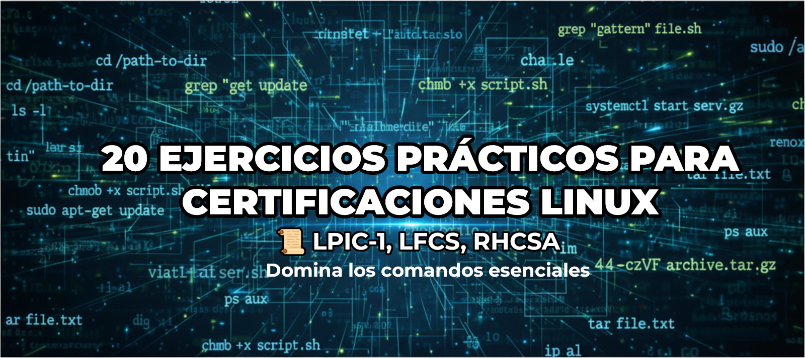

= Módulo Experto: Desafíos Prácticos del Administrador Linux
Alex Callejas
:doctype: article
:revdate: Oct 18, 2025
:keywords: ejercicios, comandos, lpic-1, lfcs, rhcsa

== Módulo Experto: Desafíos Prácticos del Administrador Linux

=== Solución a los 20 Ejercicios Prácticos para Certificaciones Linux (LPIC-1, LFCS, RHCSA)

💡 *Recomendación*: Utiliza una máquina virtual recién instalada o un entorno de laboratorio donde puedas experimentar libremente. Debes tener permisos de `sudo` o acceder como usuario `root` para completar los ejercicios de administración (Volúmenes, Usuarios y Grupos).

.Temas Cubiertos
|===
|Categoría de Ejercicios |Enfoque Principal |Certificaciones Relevantes

|*I. CLI y Navegación*
|FHS, `cp`, `mv`, Comodines
|LPIC-1, LFCS, RHCSA

|*II. Permisos y Propiedad*
|`chmod`, SUID, *ACLs*
|LPIC-1, *LFCS, RHCSA*

|*III. Usuarios y sudo*
|`useradd`, `groupmod`, *`visudo`*
|LPIC-1, *LFCS, RHCSA*

|*IV. Texto, Redirección y Enlaces*
|Pipes, `grep`, *`sed`*, Enlaces Duros/Blandos
|LPIC-1, *LFCS, RHCSA*

|*V. Almacenamiento (Montaje)*
|`lsblk`, `mount`, `/etc/fstab`
|LPIC-1, LFCS, RHCSA

|*VI. Gestión de Volumen Lógico*
|PV, VG, LV, *`lvextend`, `xfs_growfs`*
|*LFCS, RHCSA*
|===

== I. Ejercicios de CLI y Navegación

=== Reactivo 1: Creación de Estructura y Archivo (FHS)
*Objetivo:* Crear una estructura de directorios simulada para un proyecto en el directorio `/tmp` y un archivo inicial con un solo comando.

[cols="1,1", options="header"]
|===
|Instrucciones (Paso a paso) |Solución
|**1. Tarea:** En el directorio `/tmp`, crea la estructura de directorios `/proyecto/src`, `/proyecto/docs` y `/proyecto/bin`. Dentro de `/proyecto/src`, crea un archivo vacío llamado `main.sh`. *Todo en una sola línea de comando.*
|
``
$ mkdir -p /tmp/proyecto/{src,docs,bin} && touch /tmp/proyecto/src/main.sh
``
|**2. Verificación:** Confirma la existencia de la estructura y el archivo.
|
``
$ ls -R /tmp/proyecto
``
|===

=== Reactivo 2: Copia y Comodines
*Objetivo:* Usar comodines para copiar un conjunto específico de archivos.

[cols="1,1", options="header"]
|===
|Instrucciones (Paso a paso) |Solución
|**1. Configuración:** Crea varios archivos de texto en `/tmp/proyecto/docs`.
|
``
$ touch /tmp/proyecto/docs/{carta,capitulo,reporte,nota}.txt
``
|**2. Tarea:** Copia solo los archivos `.txt` en el directorio `/tmp/proyecto/docs` que *empiezan por la letra `c`* a una nueva carpeta llamada `/tmp/backups`.
|
``
$ mkdir /tmp/backups && cp /tmp/proyecto/docs/c*.txt /tmp/backups
``
|===

=== Reactivo 3: Obtención de Ayuda (`info`)
*Objetivo:* Usar la utilidad `info` para buscar la sección sobre el comando `cp`.

[cols="1,1", options="header"]
|===
|Instrucciones (Paso a paso) |Solución
|**1. Tarea:** Abre el manual de ayuda de `cp` usando el comando `info`.
|
``
$ info cp
``
|**2. Tarea:** Una vez dentro, busca la sección sobre la opción `-p` (preservar atributos).
|*Dentro de `info`:* Presiona `s` (search) y escribe `preserve`.
|===

== II. Ejercicios de Permisos y Propiedad

=== Reactivo 4: Permisos con Notación Octal
*Objetivo:* Aplicar un conjunto de permisos preciso usando la notación octal.

[cols="1,1", options="header"]
|===
|Instrucciones (Paso a paso) |Solución
|**1. Configuración:** Crea un archivo en `/tmp/secreto_de_permisos.conf`.
|
``
$ touch /tmp/secreto_de_permisos.conf
``
|**2. Tarea:** Aplica los permisos `rwxr-x---`. Notación octal: Propietario (7), Grupo (5), Otros (0).
|
``
$ chmod 750 /tmp/secreto_de_permisos.conf
``
|**3. Verificación:** Muestra los permisos aplicados.
|
``
$ ls -l /tmp/secreto_de_permisos.conf
``
|===

=== Reactivo 5: El Sticky Bit en Directorios (LFCS/RHCSA)
*Objetivo:* Configurar un directorio compartido para que los usuarios puedan crear archivos, pero solo ellos puedan eliminarlos.

[cols="1,1", options="header"]
|===
|Instrucciones (Paso a paso) |Solución
|**1. Configuración:** Crea el directorio `/tmp/compartido` y establece permisos `rwxrwxrwt`.
|
``
$ mkdir /tmp/compartido && chmod 1777 /tmp/compartido
``
|**2. Tarea:** Asegúrate de que el *Sticky Bit* (la `t`) esté aplicado.
|
``
$ ls -ld /tmp/compartido
``
|===

=== Reactivo 6: Cambio de Grupo Propietario
*Objetivo:* Cambiar el grupo de un archivo a un grupo existente (`sysadmin`) sin modificar el propietario.

[cols="1,1", options="header"]
|===
|Instrucciones (Paso a paso) |Solución
|**1. Configuración:** Crea el grupo `sysadmin` y el archivo `/tmp/archivo_grupo.txt`.
|
``
$ sudo groupadd sysadmin && touch /tmp/archivo_grupo.txt
``
|**2. Tarea:** Cambia el grupo propietario del archivo a `sysadmin`.
|
``
$ sudo chgrp sysadmin /tmp/archivo_grupo.txt
``
|===

=== Reactivo 7: Uso de ACLs para Acceso Fino (RHCSA/LFCS)
*Objetivo:* Conceder acceso de lectura a un usuario específico (`ana`) utilizando Listas de Control de Acceso (ACLs).

[cols="1,1", options="header"]
|===
|Instrucciones (Paso a paso) |Solución
|**1. Configuración:** Asegúrate de que tienes el paquete de ACLs (`acl`) instalado y crea el usuario `ana`.
|
``
$ sudo useradd ana
``
|**2. Tarea:** Usa `setfacl` para dar permiso de *solo lectura* (`r`) al usuario `ana` sobre el archivo `/tmp/archivo_grupo.txt`.
|
``
$ sudo setfacl -m u:ana:r /tmp/archivo_grupo.txt
``
|**3. Verificación:** Muestra la ACL para confirmar el permiso.
|
``
$ getfacl /tmp/archivo_grupo.txt
``
|===

== III. Ejercicios de Gestión de Usuarios y `sudo`

=== Reactivo 8: Creación de Usuario Personalizada
*Objetivo:* Crear un usuario con un directorio *home* personalizado.

[cols="1,1", options="header"]
|===
|Instrucciones (Paso a paso) |Solución
|**1. Tarea:** Crea el directorio `/data/usuarios` (si no existe).
|
``
$ sudo mkdir -p /data/usuarios
``
|**2. Tarea:** Crea un usuario llamado `analista` y establece su directorio *home* en `/data/usuarios/analista`.
|
``
$ sudo useradd -d /data/usuarios/analista analista
``
|**3. Verificación:** Confirma la ruta del *home* en `/etc/passwd`.
|
``
$ grep analista /etc/passwd
``
|===

=== Reactivo 9: Modificación de Grupos
*Objetivo:* Añadir el usuario `analista` a un grupo secundario existente (`desarrollo`).

[cols="1,1", options="header"]
|===
|Instrucciones (Paso a paso) |Solución
|**1. Tarea:** Añade el usuario `analista` al grupo `desarrollo`. (Asume que el grupo ya existe o lo creas con `sudo groupadd desarrollo`).
|
``
$ sudo usermod -aG desarrollo analista
``
|**2. Verificación:** Confirma la membresía de `analista` en el grupo.
|
``
$ groups analista
``
|===

=== Reactivo 10: Configuración de `sudo` sin Contraseña (LFCS/RHCSA)
*Objetivo:* Usar `visudo` para permitir que el usuario `analista` ejecute un comando específico como `root` sin solicitar su contraseña.

[cols="1,1", options="header"]
|===
|Instrucciones (Paso a paso) |Solución
|**1. Tarea:** Edita el archivo `/etc/sudoers` de forma segura.
|
``
sudo visudo
``
|**2. Tarea:** Añade la línea necesaria para que el usuario `analista` pueda ejecutar el comando `/usr/sbin/service cron restart` *sin contraseña*.
|
``
# Dentro de `visudo`, añadir:

analista ALL=(ALL) NOPASSWD: /usr/sbin/service cron restart
``
|**3. Verificación:** Prueba la ejecución del comando.
|
``
$ sudo -u analista sudo -n /usr/sbin/service cron restart
``
|===

== IV. Ejercicios de Texto, Redirección y Enlaces

=== Reactivo 11: Redirección y Tuberías (`|`)
*Objetivo:* Contar y guardar el número de usuarios que tienen `bash` como *shell* por defecto en `/etc/passwd`.

[cols="1,1", options="header"]
|===
|Instrucciones (Paso a paso) |Solución
|**1. Tarea:** Utiliza una tubería (`\|`) para filtrar las líneas con `/bin/bash` en `/etc/passwd`, contarlas (`wc -l`) y redirigir el resultado a un archivo llamado `/tmp/conteo_bash.txt`. 
|
``
$ grep /bin/bash /etc/passwd \| wc -l > /tmp/conteo_bash.txt
``
|**2. Verificación:** Muestra el contenido del archivo resultante.
|
``
$ cat /tmp/conteo_bash.txt
``
|===

=== Reactivo 12: Búsqueda Contextual con `grep`
*Objetivo:* Encontrar la línea del usuario `root` en `/etc/shadow` y mostrar las líneas circundantes para tener contexto.

[cols="1,1", options="header"]
|===
|Instrucciones (Paso a paso) |Solución
|**1. Tarea:** Busca la cadena `root` en `/etc/shadow` y muestra una línea de contexto *antes (`-B 1`)* y una línea de contexto *después (`-A 1`)* del resultado.
|
``
$ sudo grep -B 1 -A 1 root /etc/shadow
``
|===

=== Reactivo 13: Sustitución con `sed` (LFCS/RHCSA)
*Objetivo:* Usar `sed` para reemplazar una cadena de texto en un archivo y mostrar la salida, sin modificar el archivo original.

[cols="1,1", options="header"]
|===
|Instrucciones (Paso a paso) |Solución
|**1. Configuración:** Crea un archivo de configuración de prueba.
|
``
$ echo 'ServerName localhost' > /tmp/webserver.conf
``
|**2. Tarea:** Reemplaza *todas las ocurrencias* de `localhost` por `produccion.local` en `/tmp/webserver.conf` y muéstralo en pantalla.
|
``
$ sed 's/localhost/produccion.local/g' /tmp/webserver.conf
``
|===

=== Reactivo 14: Enlaces Duros y Blandos
*Objetivo:* Crear y verificar enlaces duros y blandos, observando los números de inodo.

[cols="1,1", options="header"]
|===
|Instrucciones (Paso a paso) |Solución
|**1. Configuración:** Crea un archivo de texto.
|
``
$ echo "Contenido original" > /tmp/inodo_original.txt
``
|**2. Tarea:** Crea un *enlace duro* (`enlace_duro.txt`) y un *enlace blando* (`enlace_blando.txt`) al archivo original.
|
``
$ ln /tmp/inodo_original.txt /tmp/enlace_duro.txt && ln -s /tmp/inodo_original.txt /tmp/enlace_blando.txt
``
|**3. Verificación:** Muestra los números de inodo (`-i`). El enlace duro debe compartir el inodo.
|
``
$ ls -i /tmp/inodo_original.txt /tmp/enlace_duro.txt /tmp/enlace_blando.txt
``
|===

== V. Ejercicios de Almacenamiento y Montaje

[NOTE]
====
Los ejercicios 15, 16 y 17 asumen la existencia de dispositivos de bloque adicionales como `/dev/sdb` y `/dev/sdb1`, lo cual requiere la configuración previa de la máquina virtual (añadir discos virtuales).
====

=== Reactivo 15: Identificación de Dispositivos
*Objetivo:* Usar `lsblk` para obtener una lista clara de los dispositivos de bloque y sus puntos de montaje.

[cols="1,1", options="header"]
|===
|Instrucciones (Paso a paso) |Solución
|**1. Tarea:** Muestra un listado de bloques *legible por humanos* y que incluya el tamaño y el tipo.
|
``
$ lsblk -h
``
|**2. Tarea:** Muestra el uso del espacio de disco de los sistemas de archivos montados, en formato legible por humanos y mostrando el tipo de sistema de archivos.
|
``
$ df -hT
``
|===

=== Reactivo 16: Montaje Temporal
*Objetivo:* Montar una partición existente (`/dev/sdb1`) en un directorio temporal.

[cols="1,1", options="header"]
|===
|Instrucciones (Paso a paso) |Solución
|**1. Tarea:** Crea el punto de montaje temporal `/mnt/tempdata`.
|
``
$ sudo mkdir /mnt/tempdata
``
|**2. Tarea:** Monta la partición `/dev/sdb1` (asumiendo formato) en el punto de montaje.
|
``
$ sudo mount /dev/sdb1 /mnt/tempdata
``
|**3. Verificación:** Muestra el uso del disco del punto de montaje.
|
``
$ df -h /mnt/tempdata
``
|===

=== Reactivo 17: Montaje Persistente con `/etc/fstab`
*Objetivo:* Configurar una partición para que se monte automáticamente al iniciar.

[cols="1,1", options="header"]
|===
|Instrucciones (Paso a paso) |Solución
|**1. Configuración:** Consigue el UUID de `/dev/sdb2`.
|
``
$ sudo blkid /dev/sdb2
``
|**2. Tarea:** Crea el punto de montaje `/data/archivos`.
|
``
$ sudo mkdir -p /data/archivos
``
|**3. Tarea:** Añade la entrada necesaria en `/etc/fstab` para que se monte como `xfs` en `/data/archivos`, con valores predeterminados y la opción `nofail`.
|
``
# Ejemplo de entrada en /etc/fstab:

UUID=[UUID_AQUI] /data/archivos xfs defaults,nofail 0 0
``
|**4. Verificación (Sin reiniciar):** Prueba si la nueva entrada de `fstab` funciona.
|
``
$ sudo mount -a
``
|===

== VI. Ejercicios de LVM (Énfasis RHCSA/LFCS)

[NOTE]
====
Estos ejercicios requieren al menos dos discos virtuales adicionales sin particionar (`/dev/sdb` y `/dev/sdc`) para simular la infraestructura de LVM.
====

=== Reactivo 18: Creación Completa de LVM
*Objetivo:* Crear un Volumen Físico (PV), un Grupo de Volúmenes (VG) y un Volumen Lógico (LV) de 10GB.

[cols="1,1", options="header"]
|===
|Instrucciones (Paso a paso) |Solución
|**1. Tarea:** Crea un PV en `/dev/sdb` y `/dev/sdc`.
|
``
$ sudo pvcreate /dev/sdb /dev/sdc
``
|**2. Tarea:** Crea un VG llamado `prod_vg` con ambos PV.
|
``
$ sudo vgcreate prod_vg /dev/sdb /dev/sdc
``
|**3. Tarea:** Crea un LV llamado `lv_data` de 10GB, formatéalo como `ext4` y móntalo en `/datos_prod`.
|
``
$ sudo lvcreate -n lv_data -L 10G prod_vg
$ sudo mkfs.ext4 /dev/prod_vg/lv_data
$ sudo mkdir /datos_prod && sudo mount /dev/prod_vg/lv_data /datos_prod
``
|===

=== Reactivo 19: Ampliación de Volumen (Ext4)
*Objetivo:* Ampliar el LV anterior con 5GB adicionales y redimensionar el sistema de archivos `ext4`.

[cols="1,1", options="header"]
|===
|Instrucciones (Paso a paso) |Solución
|**1. Tarea:** Amplía el Volumen Lógico `lv_data` en 5GB.
|
``
$ sudo lvextend -L +5G /dev/prod_vg/lv_data
``
|**2. Tarea:** Redimensiona el sistema de archivos `ext4` para que ocupe el nuevo espacio del LV.
|
``
$ sudo resize2fs /dev/prod_vg/lv_data
``
|**3. Verificación:** Muestra el nuevo tamaño del punto de montaje.
|
``
$ df -h /datos_prod
``
|===

=== Reactivo 20: Ampliación al Espacio Libre Total (XFS - RHCSA)
*Objetivo:* Ampliar el LV para usar todo el espacio libre restante en el VG y redimensionar el sistema de archivos `xfs`.

[cols="1,1", options="header"]
|===
|Instrucciones (Paso a paso) |Solución
|**1. Tarea:** Amplía el LV `lv_data` para usar *el 100% del espacio libre restante* del `prod_vg`.
|
``
$ sudo lvextend -l +100%FREE /dev/prod_vg/lv_data
``
|**2. Tarea:** Redimensiona el sistema de archivos *XFS* para que reconozca el nuevo espacio (usando el punto de montaje `/datos_prod`).
|
``
$ sudo xfs_growfs /datos_prod
``
|**3. Verificación:** Muestra el nuevo tamaño del punto de montaje.
|
``
$ df -h /datos_prod
``
|===

== Conclusión y Próximos Pasos

Dominar estos 20 ejercicios te posiciona firmemente para enfrentar los laboratorios prácticos de las certificaciones. Los temas de *ACLs*, *sudo* y *LVM* son especialmente críticos para **RHCSA** y **LFCS**.

[TIP]
====
La clave no es memorizar los comandos, sino entender *por qué* y *cómo* funcionan los flujos de datos y la gestión del almacenamiento.
====

_¿Qué ejercicio te resultó más desafiante? ¡Déjanos un comentario y comparte tu experiencia de práctica!_

// Enlace de la publicación original (para versiones fuera de GitHub)
// link:https://www.rootzilopochtli.com/modulo-experto-20-desafios-practicos[Publicación Original del Blog]

***

== Invitación a la Comunidad 🚀

Este *post* forma parte de una serie dedicada a la arquitectura y administración de sistemas Linux. ¡Queremos construir el mejor recurso posible *con tu ayuda*!

Te invitamos a:

* *Clonar el Repositorio:* El código fuente de todos nuestros artículos está disponible en *GitHub*.
* *Contribuir:* Si encuentras algún error, tienes sugerencias para mejorar la claridad de los conceptos o deseas proponer correcciones técnicas, no dudes en enviar un *Pull Request* (Solicitud de extracción).
* *Comentar:* ¿Tienes una pregunta o un punto de vista diferente sobre algún concepto? Abre un *Issue* (Incidencia) en el repositorio para iniciar la discusión.

Tu colaboración es vital para mantener este contenido preciso y actualizado.

*¡Encuentra el repositorio y participa aquí:* link:https://github.com/rootzilopochtli/introduccion-a-linux[github.com/rootzilopochtli/introduccion-a-linux]